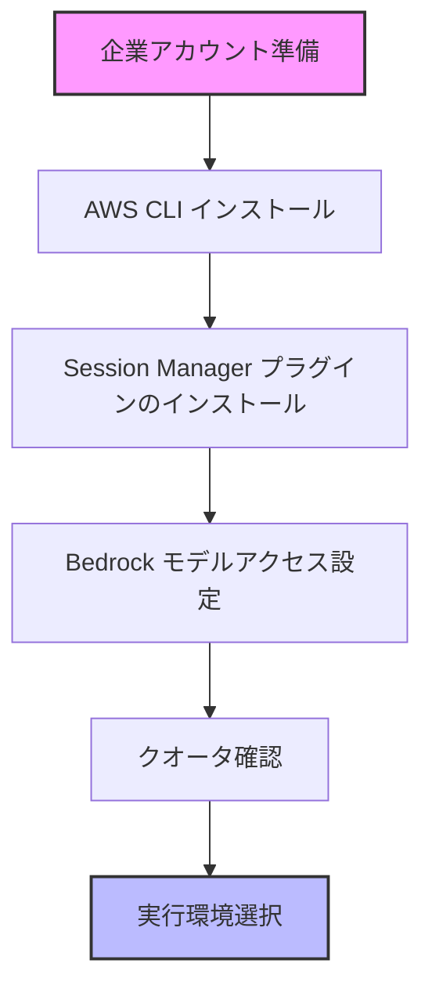

# 企業アカウントでの環境セットアップ

このガイドでは、企業の AWS アカウントを使用してワークショップ環境をセットアップする手順を説明します。

## 前提条件



### AWS CLI のインストール

ローカル PC に AWS CLI v2 をインストールしてください。

```bash
# macOS の場合
brew install awscli

# Windows の場合
# https://docs.aws.amazon.com/ja_jp/cli/latest/userguide/install-cliv2-windows.html からインストーラーをダウンロード

# Linux の場合
curl "https://awscli.amazonaws.com/awscli-exe-linux-x86_64.zip" -o "awscliv2.zip"
unzip awscliv2.zip
sudo ./aws/install
```

### Session Manager プラグインのインストール

AWS Systems Manager Session Manager プラグインをインストールしてください。

```bash
# macOS の場合
brew install session-manager-plugin

# Windows の場合
# https://docs.aws.amazon.com/ja_jp/systems-manager/latest/userguide/session-manager-working-with-install-plugin.html からインストーラーをダウンロード

# Linux の場合
curl "https://s3.amazonaws.com/session-manager-downloads/plugin/latest/linux_64bit/session-manager-plugin.rpm" -o "session-manager-plugin.rpm"
sudo yum install -y session-manager-plugin.rpm
```

## Amazon Bedrock の設定

### モデルアクセスの有効化

1. AWS コンソールにログイン
2. Amazon Bedrock サービスに移動
3. 左側メニューから「Model access」を選択
4. 「Manage model access」をクリック
5. 以下のモデルを選択：
   - Anthropic Claude 3 Sonnet
   - Anthropic Claude 3 Haiku
   - Anthropic Claude 3 Opus
6. 「Save changes」をクリック

> **注意**: モデルアクセスの承認には数分かかる場合があります

### クオータの確認

以下のリージョンでクオータを確認してください：
- us-east-1
- us-east-2
- us-west-2

1. AWS コンソールで Service Quotas に移動
2. Amazon Bedrock を選択
3. 以下のクオータを確認：
   - TPM (Tokens per minute) が 1,000,000 以上であること
   - Cross-region model inference tokens per minute for Anthropic Claude 3.7 Sonnet V1

クオータが不足している場合は、引き上げリクエストを行ってください。

## 実行環境の選択

ワークショップを実施する環境を選択してください：

### EC2 環境（推奨）

EC2 環境を使用すると以下のメリットがあります：
- 事前に必要なツールがすべてインストール済み
- IAM Role による安全な認証
- 高速なネットワーク環境
- すべてのワークショップに対応

👉 [EC2 環境のセットアップへ](./selfenv-ec2.md)

### ローカル PC 環境

ローカル PC 環境を使用する場合：
- 自分のマシンで直接実行
- 追加ツールのインストールが必要
- 一部のワークショップで制限あり
- IAM Role 認証に対応していないワークショップあり

👉 [ローカル PC 環境のセットアップへ](./selfenv-local.md)

## AWS アカウント認証情報の設定

AWS CLI の認証情報を設定します。

```bash
# default のプロファイルが既にある場合に上書きをしないために
# 既存の ~/.aws/{credentials,config} の profile 名と競合しない profile 名にしてください。
export AWS_PROFILE=cline

# IAM ユーザーの場合
aws configure

# または IAM Identity Center (SSO) の場合
aws configure sso
```

設定されているプロファイルの一覧を確認：

```bash
aws configure list-profiles
```

AWS 認証情報が正しく設定されているか確認：

```bash
# デフォルトプロファイルの場合
aws sts get-caller-identity

# プロファイル名を指定する場合（例: cline）
aws sts get-caller-identity --profile cline
```

正常に動作すると、以下のような情報が表示されます：
```json
{
    "UserId": "XXXXXXXXXXXXXXXXXXXXX",
    "Account": "123456789012",
    "Arn": "arn:aws:iam::123456789012:user/username"
}
```

---

**[次のステップ]**
- [EC2 環境のセットアップ（推奨）](./selfenv-ec2.md)
- [ローカル PC 環境のセットアップ](./selfenv-local.md)
- [戻る](./README.md)
