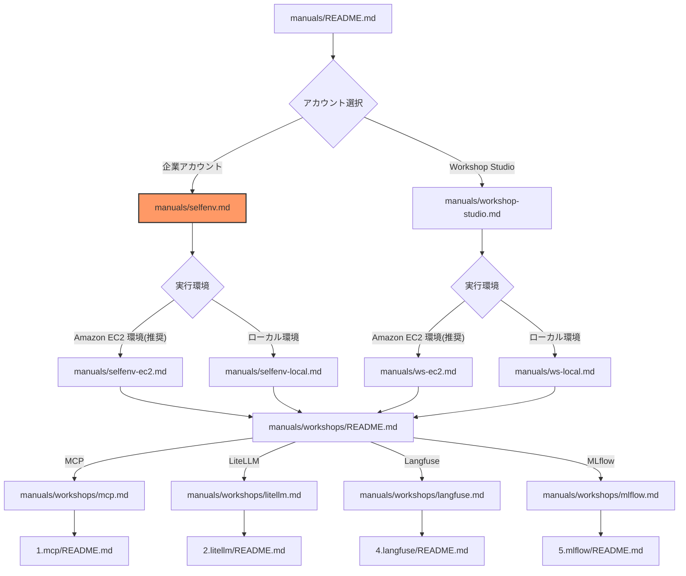

# セルフアカウントでの環境セットアップ

このガイドでは、セルフ AWS アカウントを使用してワークショップ環境をセットアップする手順を説明します。
可能であればワークショップ当日までにこのページの準備が完了していることが望ましいです。

## ドキュメント構成

## 前提条件

### 最低限必要な権限

このワークショップでは、以下の AWS サービスを利用します。Administrator アクセス権限を保有していることを推奨します。
`aws congigure` もしくは `aws configure sso` で AWS CLI もしくは boto3 をローカル PC 上で適切な権限で実行できることが前提です。
AWS Console にアクセスして AWS CloudShell を利用する必要があります。

- Amazon SageMaker
- Amazon S3
- AWS CloudFormation スタックの作成と管理
- Amazon VPC、サブネット、Internet Gateway、NAT Gateway、ルートテーブルなどのネットワークリソースの作成と管理
- Amazon EC2 インスタンスの作成と管理
- IAM ロールとポリシーの作成と管理
- AWS Systems Manager 関連の権限
- AWS Lambda 関数の作成と実行
- Amazon Bedrock モデルの呼び出し権限
- AWS CloudShell へのアクセス

### AWS アカウントの準備

1. Amazon Bedrock の有効化
   - [Amazon Bedrock コンソール](https://console.aws.amazon.com/bedrock)にアクセス
   - 使用するモデル（Claude 3.7 Sonnet v2 など）へのアクセスを有効化
   - **利用リージョン**: us-east-1, us-east-2, us-west-2

2. IAM 権限の設定
   - Amazon Bedrock へのアクセス権限
   - 必要に応じて Amazon EC2、AWS CloudFormation の権限

3. クオータの確認
   - Amazon Bedrock のクオータを確認
   - 必要に応じてクオータの引き上げをリクエスト

### 必要なツール

| ツール | バージョン | 用途 |
|--------|-----------|------|
| AWS CLI | v2 | AWS 操作 |

## 実行環境の選択

ワークショップの実行環境として、以下の2つのオプションがあります：

### 1. Amazon EC2 環境（推奨）

Amazon EC2 インスタンスを使用してワークショップを実施する場合：

- AWS CloudFormation によって事前設定済みの環境を利用可能
- IAM Role による認証が可能
- セキュアな実行環境

👉 [Amazon EC2 環境のセットアップへ](./selfenv-ec2.md)

### 2. ローカル PC 環境

ローカル PC を使用してワークショップを実施する場合：

- 既存の開発環境を利用可能
- ローカル PC の環境依存によるトラブルシューティングの複雑化
- ワークショップ実施に制限あり

👉 [ローカル PC 環境のセットアップへ](./selfenv-local.md)

---

**[次のステップ]**
- [Amazon EC2 環境のセットアップ](./selfenv-ec2.md)
- [ローカル PC 環境のセットアップ](./selfenv-local.md)
- [ワークショップ一覧に戻る](./README.md)
