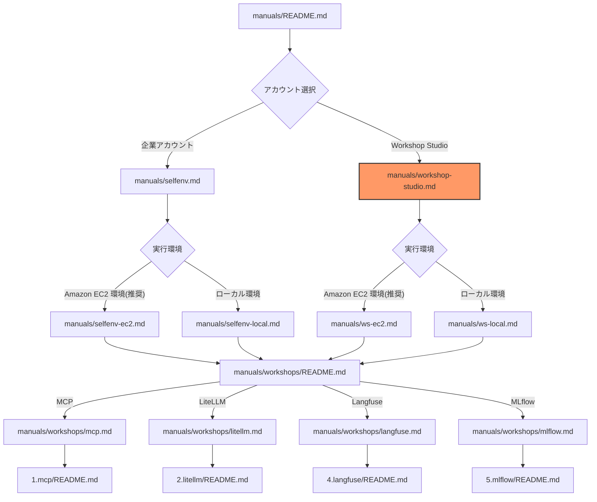

# Workshop Studio 環境セットアップ

このガイドでは、AWS Workshop Studio 環境を使用してワークショップを実施する手順を説明します。

## ドキュメント構成

## 前提条件

### 最低限必要な権限

このワークショップでは、以下の AWS サービスを利用します。Administrator アクセス権限を保有していることを推奨します。
`aws congigure` もしくは `aws configure sso` で AWS CLI もしくは boto3 をローカル PC 上で適切な権限で実行できることが前提です。
Workshop Studio ではすでに適切な権限が設定されているため、事前に AWS アカウントの準備は不要です。

### 必要なツール

| ツール | バージョン | 用途 |
|--------|-----------|------|
| AWS CLI | v2 | AWS 操作 |

## 実行環境の選択

Workshop Studio 環境では、以下の 2 つの実行環境オプションがあります：

### 1. Amazon EC2 環境（推奨）

Amazon EC2 インスタンスを使用してワークショップを実施する場合：

- AWS CloudFormation によって事前設定済みの環境を利用可能
- IAM Role による認証が可能
- セキュアな実行環境

👉 [Amazon EC2 環境のセットアップへ](./ws-ec2.md)

### 2. ローカル PC 環境

ローカル PC を使用してワークショップを実施する場合：

- 既存の開発環境を利用可能
- ローカル PC の環境依存によるトラブルシューティングの複雑化
- ワークショップ実施に制限あり

👉 [ローカル PC 環境のセットアップへ](./ws-local.md)

## Workshop Studio へのアクセス

1. ワークショップ主催者から提供された URL にアクセス
2. Event access code を入力
3. Terms & conditions に同意
4. 「Open AWS Console」をクリック

## 認証情報の取得

1. AWS コンソールにログイン後、右上のアカウント名をクリック
2. 「AWS 認証情報のコピー」を選択
3. 認証情報をメモ帳などに保存

## 注意事項

1. **セッション時間**
   - Workshop Studio のセッションには時間制限があります（通常 4-8 時間）
   - セッションの時間制限超後は環境が削除されます

2. **リソース制限**
   - Workshop Studio 環境では一部のサービスが制限されている場合があります
   - 提供されたリソースの範囲内で作業を行ってください

3. **認証情報の有効期限**
   - Workshop Studio の認証情報には有効期限があります
   - セッション終了後は認証情報が無効になります

---

**[次のステップ]**
- [EC2環境のセットアップ](./ws-ec2.md)
- [ローカルPC環境のセットアップ](./ws-local.md)
- [ワークショップ一覧に戻る](./README.md)
