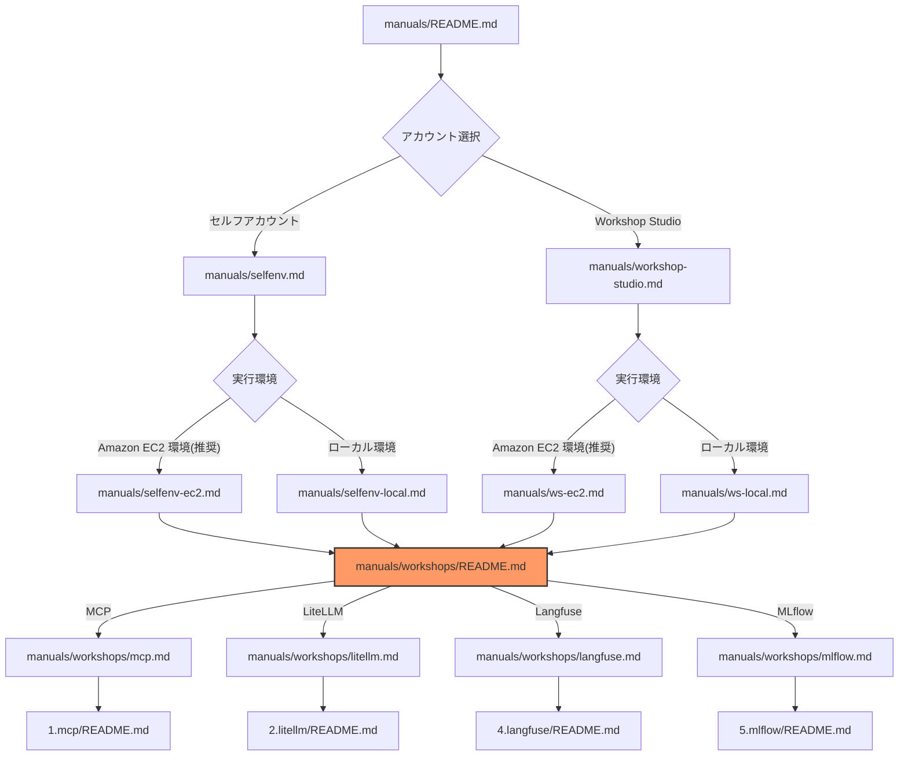
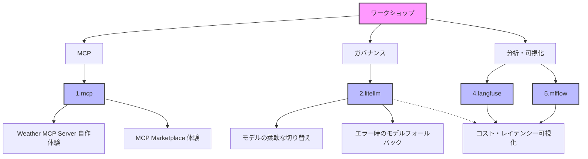

# ワークショップ一覧

このガイドでは、利用可能なワークショップの一覧と、各ワークショップの概要を説明します。

## ドキュメント構成

## ワークショップの構成

## 実行環境別のワークショップ対応状況

| ワークショップ | Amazon EC2環境 | ローカルPC 環境 | AWS 認証方式 | 備考 |
|--------------|---------|--------------|----------|------|
| [1.mcp](./mcp.md) | ◎ | ○ | IAM Role/Key | 他とは疎結合に実施可能 |
| [2.litellm](./litellm.md) | ◎ | ○ | IAM Role/Key | Docker が必須 |
| [4.langfuse](./langfuse.md) | ◎ | ○ | IAM Role/Key | 2.litellm とセット |
| [5.mlflow](./mlflow.md) | ○ | ○ | Key のみ | AWS CDK が必要 |

凡例：
- ◎：推奨環境
- ○：対応
- △：一部制限あり
- ×：非対応

## 1. MCP（Model Context Protocol）

AI エージェントの機能を MCP で拡張し、外部 API やサービスと連携するための基本的なワークショップです。
Model Context Protocol (MCP) は、AI モデルとデータソースやツールを接続するための標準化されたオープンプロトコルです。
このセクションでは、MCP の基本概念を理解し、実際に TypeScript を使用して MCP サーバーを実装することで、AI エージェントの機能拡張方法を学びます。

**主な学習内容：**
- MCP の基本概念と設計
- Dummy Weather API との連携実装
- MCP Marketplace の活用

**実施 Options**
- [ ] Option 1: 天気予報 MCP を自作するワークショップを体験します
- [ ] Option 2: MCP Marketplace の MCP を体験します
- [ ] Option 3: AWS が提供する AWS MCP を体験します

👉 [MCP ワークショップへ](./mcp.md)

## 2. LiteLLM

LiteLLM Proxy は複数の LLM プロバイダーを統一的に扱うためのプロキシサーバーです。
このセクションでは、Amazon Bedrock 上の Claude モデルを LiteLLM Proxy を通じて利用する方法を学びます。
また、エラー発生時のフォールバック機能の実装を通じて、信頼性の高い AI システムの構築方法を理解できます。

**主な学習内容：**
- Amazon Bedrock との接続設定
- 複数モデルの統合管理
- エラー時のフォールバック

👉 [LiteLLM ワークショップへ](./litellm.md)

## 4. Langfuse

Langfuse は LLM アプリケーションの観察とモニタリングを行うためのオープンソースプラットフォームです。
このセクションでは、LLM の利用状況を可視化する方法を学びます。

**主な学習内容：**
- LLM の利用状況とコスト分析
- リクエスト・レスポンスの詳細な記録
- パフォーマンスとレイテンシの監視
- Langfuse Web UI の利用方法

👉 [Langfuse ワークショップへ](./langfuse.md)

## 5. MLflow

Amazon SageMaker の managed MLflow を使用して、LiteLLM Proxy の実行ログを収集・分析する方法を学びます。

**主な学習内容：**
- LLM の利用状況とコスト分析
- リクエスト・レスポンスの詳細な記録
- パフォーマンスとレイテンシの監視
- MLflow UI の利用方法

👉 [MLflow ワークショップへ](./mlflow.md)

## 注意事項

1. **環境の選択**
   - Amazon EC2 環境が推奨されます
   - ローカル PC 環境では一部機能に制限があります

2. **認証方式**
   - Amazon EC2 環境：IAM Role または AWS アクセスキー
   - ローカルPC環境：AWS アクセスキーのみ

---

**[次のステップ]**
- [MCP ワークショップを開始](./mcp.md)
- [LiteLLM ワークショップを開始](./litellm.md)
- [Langfuse ワークショップを開始](./langfuse.md)
- [MLflow ワークショップを開始](./mlflow.md)
