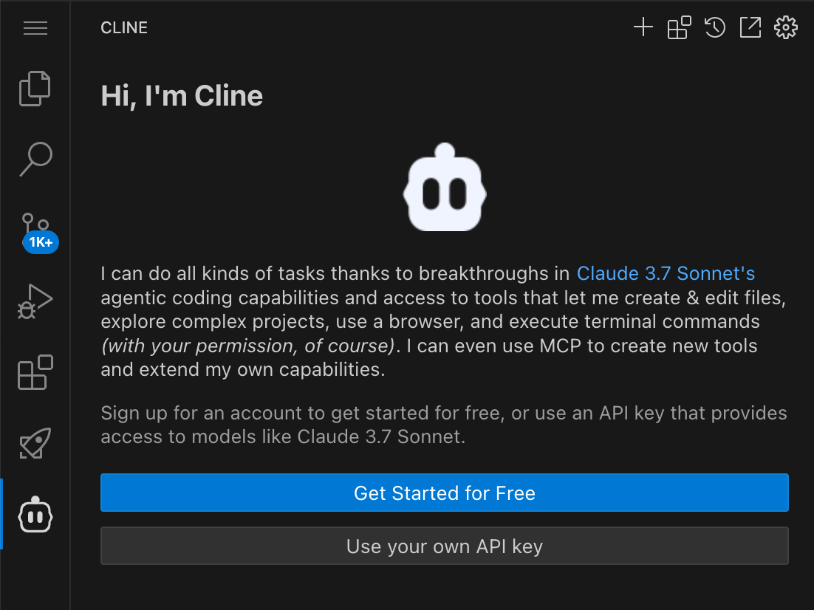

# Cline on Amazon Bedrock ワークショップ

このワークショップでは Cline on Amazon Bedrock の設定とコーディング体験を行います。

## ドキュメント構成

## Cline 機能紹介

### .clinerules 機能

#### [.clinerules ファイル](https://docs.cline.bot/improving-your-prompting-skills/prompting)

本ワークショップでは、Cline の動作をカスタマイズするための [`.clinerules`](../../0.setup/1.cline/.clinerules) ファイルのサンプルを提供しています。

`.clinerules` ファイルは、プロジェクトのルートディレクトリに配置するだけで自動的に適用される設定ファイルです。
このファイルを使用することで、プロジェクト固有の指示や規約を Cline に与えることができます。

#### テーマ別ルールファイルの追加

Cline では、特定のテーマや機能に特化したルールを定義し、Global Rules として参照することができます。
これにより機能やテーマごとに Cline のルールを管理することが可能です。ルールの ON/OFF を UI から行うことも可能です。

例えば、本ワークショップには Model Context Protocol (MCP) に関する規約を定義した [`.clinerules-mcp.md`](../../0.setup/1.cline/.clinerules-mcp.md) がサンプルとして含まれています。
このファイルには、MCP の基本概念、設定ガイドライン、セキュリティ考慮事項など、MCP に特化したルールが詳細に記述されています。

このように、テーマ別のルールファイルを作成することで、以下のような利点があります：

1. **モジュール化**: ルールを機能やテーマごとに分割し、管理が容易になります
2. **再利用性**: 共通のルールを複数のプロジェクトで再利用できます
3. **メンテナンス性**: 特定の機能に関するルールの更新が容易になります
4. **可読性**: 関心事の分離により、ルールの理解が容易になります

詳細については、[Cline の公式ドキュメント](https://docs.cline.bot/improving-your-prompting-skills/prompting)を参照してください。

---

以降、ワークショップ手順書

---

## Amazon Bedrock を利用した Cline セットアップ手順

### 1. Cline 拡張機能のインストール

VS Code の Extentions メニューから「Cline」を検索し、インストールを実行します。インストール完了後、VS Code を再起動することをお勧めします。

### 2. Amazon Bedrock API Provider の設定

#### Amazon EC2 実行環境の場合

この場合には既に Instance Profile に Bedrock アクセスポリシーが設定されているため認証設定は必要ありません。

認証方式として「Use your own API key」を選択し、以下の設定を行います：
- API Provider: Amazon Bedrock
- Model: anthropic.claude-3-7-sonnet-20250219-v1:0
- ☑️ Use cross-region inference
- ☑️ Use prompt caching
- ☑️ Enable extended thinking

#### ローカル PC 実行環境の場合

すでに前の手順で設定された aws profile 情報を指定します。

認証方式として「Use your own API key」を選択し、以下の設定を行います：
- API Provider: Amazon Bedrock
- AWS Profile Name: cline
- AWS Region: us-east-1
- Model: anthropic.claude-3-7-sonnet-20250219-v1:0
- ☑️ Use cross-region inference
- ☑️ Use prompt caching
- ☑️ Enable extended thinking

#### 設定の説明

- AWS Profile Name: cline
  - credentials ファイルで設定したプロファイル名と一致させてください
- AWS Region: us-east-1
  - Amazon Bedrock を有効化済みでサービスが利用可能なリージョンを指定
- ☑️ Use cross-region inference
  - このオプションは必ず有効にしてください
- ☑️ Use prompt caching
  - [Amazon Bedrock プロンプトキャッシュ](https://aws.amazon.com/jp/bedrock/prompt-caching/) が有効になります。
- ☑️ Enable extended thinking
  - 通常のレスポンスの前に、thinking によるモデルの内部思考を表示する。内部思考をした後に回答するモード。
- Model: 最新の Claude 3 Sonnet モデル（例: anthropic.claude-3-sonnet-*）
  - 利用可能な最新のモデルを選択してください
  - UI に表示される最新のものを選択

### セットアップ完了

設定が完了したら「Done」ボタンを押下します。

「Help Improve Cline」というダイアログが表示されたら、「Deny」を選択してください。

### トラブルシューティング

1. 認証エラーが発生する場合
   - AWS 認証情報が正しく設定されているか確認してください
   - リージョンが正しく設定されているか確認してください

2. モデルにアクセスできない場合
   - AWS アカウントで Bedrock のモデルへのアクセスが有効になっているか確認してください
   - 「Use cross-region inference」が有効になっているか確認してください

3. 拡張機能が正しく動作しない場合
   - VS Code を再起動してください
   - 拡張機能を一度アンインストールしてから再インストールしてください

---

**[次のステップ]**
- [MCP ワークショップへ進む](./workshops/mcp.md)
- [LiteLLM ワークショップへ進む](./workshops/litellm.md)
- [戻る](./README.md)
