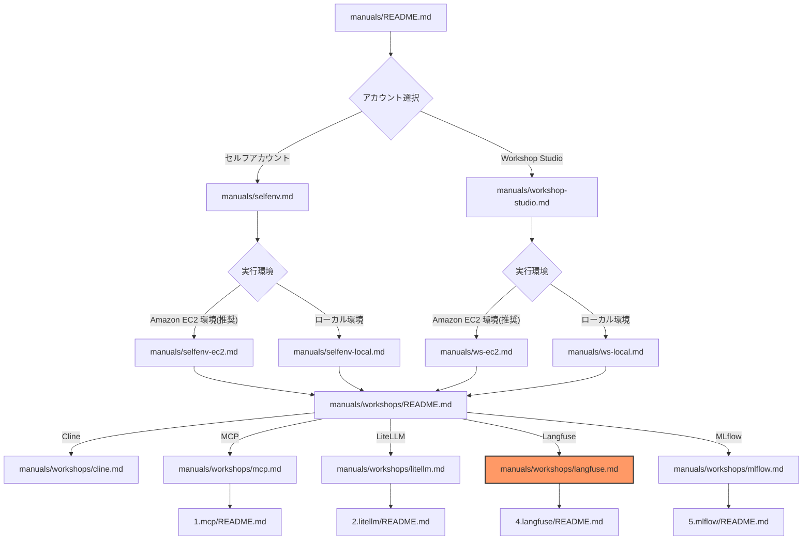
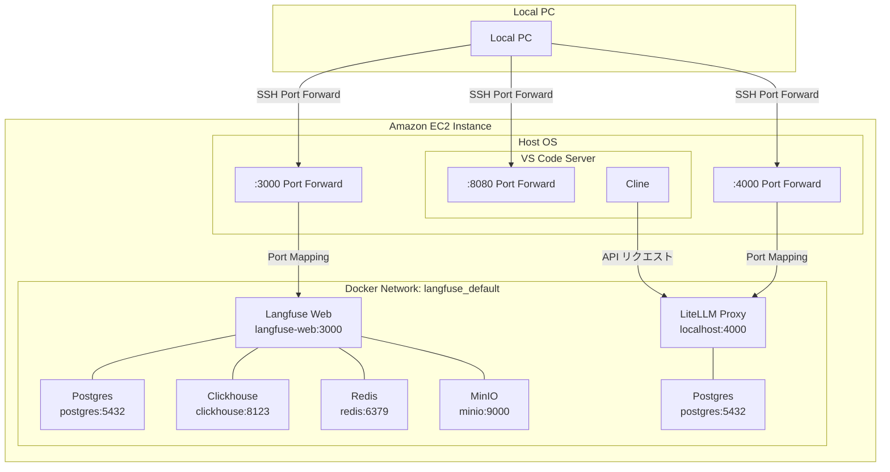
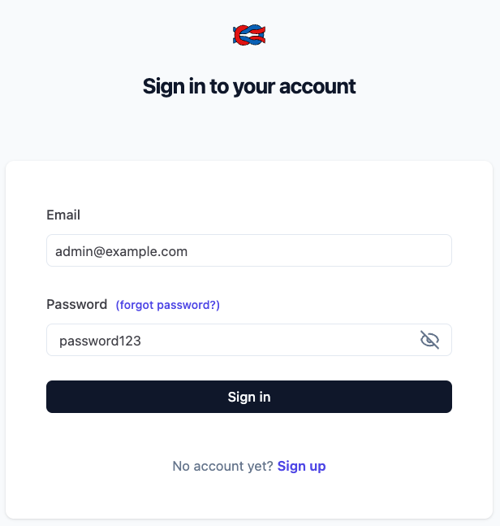
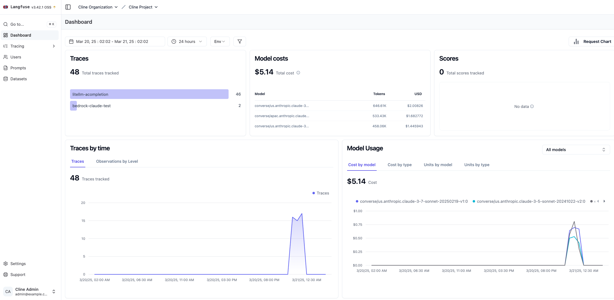
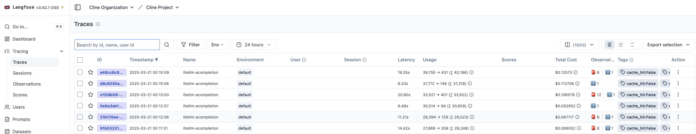
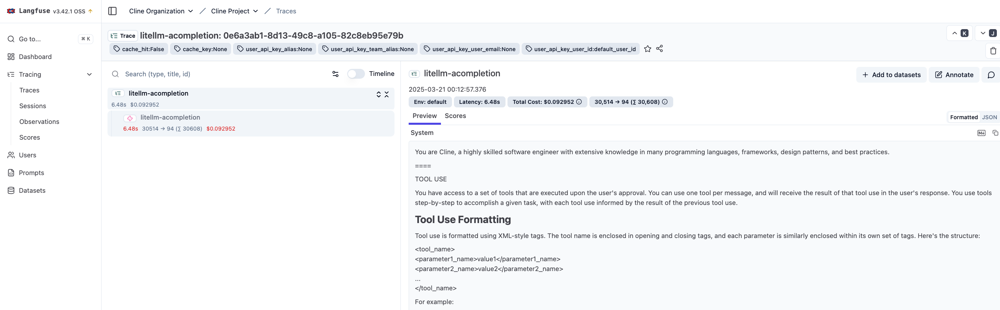

# Langfuse ワークショップ

このワークショップでは、Langfuse を使用して Cline with LiteLLM Proxy の使用状況を可視化します。

## ドキュメント構成



## Langfuse 機能紹介

[Langfuse](https://langfuse.com/) は LLM アプリケーションの観察とモニタリングを行うためのオープンソースプラットフォームです。

### 主要機能

1. **LLM アプリケーション観測性（Observability）**
   - アプリケーションの計測とトレース取り込み
   - LLM 呼び出し、検索、埋め込み、エージェントアクションの追跡
   - 複雑なログやユーザーセッションの検査・デバッグ

2. **プロンプト管理**
   - プロンプトの一元管理とバージョン管理
   - 共同反復作業のサポート
   - サーバーとクライアント側の強力なキャッシング

3. **評価システム**
   - LLM-as-a-judge による評価
   - ユーザーフィードバック収集
   - 手動ラベリング
   - カスタム評価パイプライン

4. **データセット機能**
   - テストセットとベンチマークの提供
   - 継続的な改善とデプロイ前テスト
   - 構造化された実験
   - LangChain や LlamaIndex との統合

5. **LLM プレイグラウンド**
   - プロンプトやモデル設定のテスト
   - フィードバックループの短縮
   - 開発の加速

6. **包括的な API**
   - OpenAPI 仕様
   - Postman コレクション
   - Python や JS/TS 用の型付き SDK

---

以降、ワークショップ手順書

---

## アーキテクチャ概要



## 認証方式の選択

### 1. IAM Role を使用する場合（Amazon EC2 環境のみ）

**メリット：**
- 認証情報の管理が不要
- セキュリティ的に推奨
- 自動更新される

**制限事項：**
- Amazon EC2 環境でのみ利用可能
- インスタンスプロファイルの設定が必要

**設定手順：**
1. Amazon EC2 インスタンスに適切な IAM ロールが割り当てられていることを確認
2. 特別な設定は不要（自動的にロールが使用される）

### 2. アクセスキーを使用する場合

**メリット：**
- どの環境でも利用可能
- 設定が簡単

**制限事項：**
- 認証情報の管理が必要
- 定期的な更新が必要
- セキュリティリスクの考慮が必要

**設定手順：**
1. AWS 認証情報を環境変数またはプロファイルで設定
2. LiteLLM の設定ファイルで認証方式を指定

## 環境別のセットアップ手順

作業ディレクトリに移動してください。
事前に 2.litellm が実施されていることを前提としており、LiteLLM Proxy と Langfuse が疎通を行います。 

```bash
cd ~/aws-samples/workshops/ai-coding-workshop/cline/4.langfuse
```

### Amazon EC2 環境の場合（推奨）

環境変数ファイルの準備を行いましょう。

docker compose を利用して環境を構築しており、データベースの認証情報、AWS アクセスキー、等の環境変数を設定します。
この場合は、IAM Role を用いるため AWS アクセスキーの設定は不要です。

```bash
cp .env.example .env
```

#### Langfuse の起動

スクリプトを実行して LiteLLM Proxy を起動します。内部的には docker compose を単に実行しているだけの Wrapper です。
`.env` の `CONFIG_FILE="iam_role_config.yml"` がデフォルトの LiteLLM Proxy の設定ファイルです。
この設定ファイルに基づいて LiteLLM Proxy の利用するモデル、ログ保存有無、Langfuse 設定、など様々な設定を行います。

```bash
./manage-langfuse.sh start
```

### ローカル PC 環境の場合

この場合は、IAM Role を用いるため AWS アクセスキーの設定が必要です。

```bash
cp .env.example .env
```

```bash
# .env
...
# AWS Configuration
AWS_ACCESS_KEY_ID=""
AWS_SECRET_ACCESS_KEY=""
...
```

#### Langfuse の起動

スクリプトの引数でアクセスキー認証を利用する設定ファイルを指定します。

```bash
./manage-langfuse.sh -c access_key_config.yml start
```

#### LiteLLM Proxy の設定更新（Langfuse との連携設定）

```bash
./manage-langfuse.sh update-config
```

このコマンドは、LiteLLM Proxy が Langfuse と連携してログを送信できるように URI などの LiteLLM Proxy の設定を更新して 2.litellm のコンテナを再起動します。
これにより、LLM の利用状況やプロンプトの実行履歴などを Langfuse で可視化できるようになります。

### 3. 動作確認

## Langfuse 管理画面（Web UI）

Langfuse には、Web インターフェースが用意されています。この画面では、使用状況の分析、トレースの閲覧などが可能です。

### アクセス方法

1. ポートフォワードを設定

   Amazon EC2 実行環境の場合は、VS Code Server へのアクセスとは別にポートフォワードを実行する必要があります。
   3000 → 3000 で VS Code Server のコマンドとは別のターミナルを開いて追加のコマンドを実行してください。
   ポートフォワードコマンドを実行してから UI へのアクセスが一定期間ない場合、コマンドが fail するので再度コマンドを再実行してください。

2. LiteLLM Proxy が起動している状態で、ブラウザから以下の URL にアクセス
   ```
   http://localhost:3000
   ```

2. ログイン画面が表示されます。認証情報は `.env` ファイルに設定した値を使用します。
   ```
   # デフォルト設定
   LANGFUSE_INIT_USER_EMAIL=admin@example.com
   LANGFUSE_INIT_USER_PASSWORD=password123
   ```



### ダッシュボード

ダッシュボードでは、以下の重要な情報をグラフィカルに確認できます：

- **トレース概要**: 時系列でのリクエスト数とエラー率の推移
- **モデル使用状況**: モデルごとの使用量とコスト分析
- **パフォーマンス指標**: 平均レイテンシや応答時間の分布
- **エラー分析**: エラーの種類と発生頻度の統計



### トレース機能

トレースは LLM アプリケーションの実行フローを記録したものです：

- 各 LLM 呼び出しの詳細情報
- 入力プロンプトと出力レスポンス
- 実行時間とコスト
- 時系列での追跡




---

**[次のステップ]**
- [MLflow ワークショップを開始](./mlflow.md)
- [ワークショップ一覧に戻る](./README.md)
