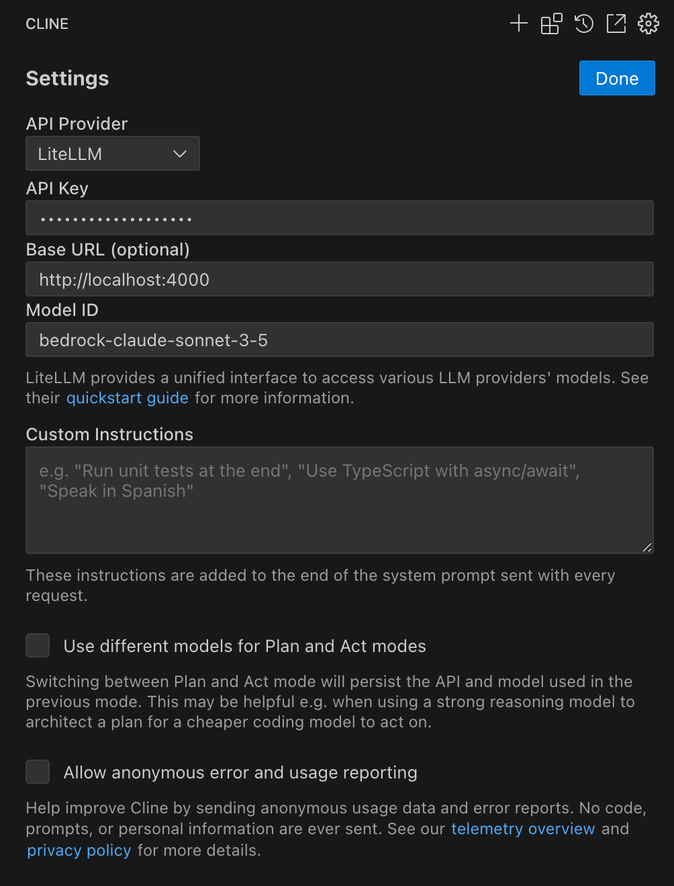

# Cline with LiteLLM Proxy ワークショップ

このワークショップでは、Cline with LiteLLM Proxy の設定とコーディング体験を行います。

## ドキュメント構成


## LiteLLM Proxy 機能紹介

### xx 機能

この設定により、Cline はエラー発生時に LiteLLM Proxy を介してフェイルオーバーする構成となります。
複数のモデルを設定している場合、LiteLLM の設定ファイルで指定した優先順位に従ってフォールバックが行われます。


詳細については、[LiteLLM Proxy の公式ドキュメント](https://docs.litellm.ai/docs/simple_proxy)を参照してください。

---

以降、ワークショップ手順書

---

## アーキテクチャ概要


## 認証方式の選択

### 1. IAM Role を使用する場合（Amazon EC2 環境のみ）

**メリット：**
- 認証情報の管理が不要
- セキュリティ的に推奨
- 自動更新される

**制限事項：**
- Amazon EC2 環境でのみ利用可能
- インスタンスプロファイルの設定が必要

**設定手順：**
1. Amazon EC2 インスタンスに適切な IAM ロールが割り当てられていることを確認
2. 特別な設定は不要（自動的にロールが使用される）

### 2. アクセスキーを使用する場合

**メリット：**
- どの環境でも利用可能
- 設定が簡単

**制限事項：**
- 認証情報の管理が必要
- 定期的な更新が必要
- セキュリティリスクの考慮が必要

**設定手順：**
1. AWS 認証情報を環境変数またはプロファイルで設定
2. LiteLLM の設定ファイルで認証方式を指定

## 環境別のセットアップ手順

作業ディレクトリに移動してください。

```bash
cd ~/aws-samples/workshops/ai-coding-workshop/cline/2.litellm
```

### Amazon EC2 環境の場合（推奨）

環境変数ファイルの準備を行いましょう。

docker compose を利用して環境を構築しており、データベースの認証情報、AWS アクセスキー、等の環境変数を設定します。
設定された環境変数は、コンテナ起動時の設定、もしくは LiteLLM Proxy の Config ファイル内で利用されます。
この場合は、IAM Role を用いるため AWS アクセスキーの設定は不要です。

```bash
cp .env.example .env
```

#### LiteLLM Proxy の起動

スクリプトを実行して LiteLLM Proxy を起動します。内部的には docker compose を単に実行しているだけの Wrapper です。
`.env` の `CONFIG_FILE="iam_role_config.yml"` がデフォルトの LiteLLM Proxy の設定ファイルです。
この設定ファイルに基づいて LiteLLM Proxy の利用するモデル、ログ保存有無、など様々な設定を行います。

```bash
./manage-litellm.sh start
```

### ローカルPC環境の場合

この場合は、IAM Role を用いるため AWS アクセスキーの設定が必要です。

```bash
cp .env.example .env
```

```bash
# .env
...
# AWS Configuration
AWS_ACCESS_KEY_ID=""
AWS_SECRET_ACCESS_KEY=""
...
```

#### LiteLLM Proxy の起動

スクリプトの引数でアクセスキー認証を利用する設定ファイルを指定します。

```bash
./manage-litellm.sh -c access_key_config.yml start
```

### 動作確認

LiteLLM Proxy の Virtual Key `sk-litellm-test-key` は .env でコンテナ作成時に設定したものです。
この Virtual Key を用いることで開発者は Amazon Bedrock に直接アクセスすることなく、間接的に モデル API を利用できます。
`iam_role_config.yml` 設定ファイルで記載されたモデルリストに対して上記の Virtual Key はアクセスすることが可能です。
以下のコマンドで上記の Virtual Key がアクセスすることが可能なモデル一覧を取得できます。

```bash
export LITELLM_MASTER_KEY=sk-litellm-test-key
curl http://localhost:4000/v1/models \
  -H "Authorization: Bearer ${LITELLM_MASTER_KEY}"
```

### Cline と LiteLLM Proxy を連携させる

それでは Cline の API Provider に LiteLLM Proxy を連携しましょう。



1. Cline の設定画面から「API Provider」セクションを開きます
2. 「Add Provider」ボタンをクリックします
3. 以下の情報を入力します：
   - **Provider Type**: LiteLLM
   - **Name**: 任意の識別名（例：「Local LiteLLM Proxy」）
   - **API Key**: 環境変数 `LITELLM_MASTER_KEY` で設定した値（例：`sk-litellm-test-key`）
   - **Base URL**: `http://localhost:4000`
   - **Model ID**: LiteLLM Proxy で利用可能なモデル ID（例：`bedrock-converse-us-claude-3-7-sonnet-v1`）、config ファイルを確認ください。
   - **[注意!] Extended thinking オプション**: Claude 3.7 Sonnet V1 を使用する場合、Cline の「Enable extended thinking」をオフにしないとエラーになるバグがあります。
4. 「Save」ボタンをクリックして設定を保存します

設定完了後、Cline から簡単なタスクを実行して動作確認してみましょう。

## LiteLLM 管理画面（Admin UI）

LiteLLM には、サービスの監視や管理を行うための Web インターフェースが用意されています。この管理画面では、モデルの一覧確認、使用状況の分析、ログの閲覧などが可能です。

### アクセス方法

1. ポートフォワードを設定

   Amazon EC2 実行環境の場合は、VS Code Server へのアクセスとは別にポートフォワードを実行する必要があります。
   4000 → 4000 で VS Code Server のコマンドとは別のターミナルを開いて追加のコマンドを実行してください。
   ポートフォワードコマンドを実行してから UI へのアクセスが一定期間ない場合、コマンドが fail するので再度コマンドを再実行してください。

2. LiteLLM Proxy が起動している状態で、ブラウザから以下の URL にアクセス
   ```
   http://localhost:4000/ui
   ```

2. ログイン画面が表示されます。認証情報は `.env` ファイルに設定した値を使用します。
   ```
   # デフォルト設定
   UI_USERNAME=litellm
   UI_PASSWORD=litellm
   ```


---

**[次のステップ]**
- [Langfuse ワークショップを開始](./langfuse.md)
- [ワークショップ一覧に戻る](./README.md)


