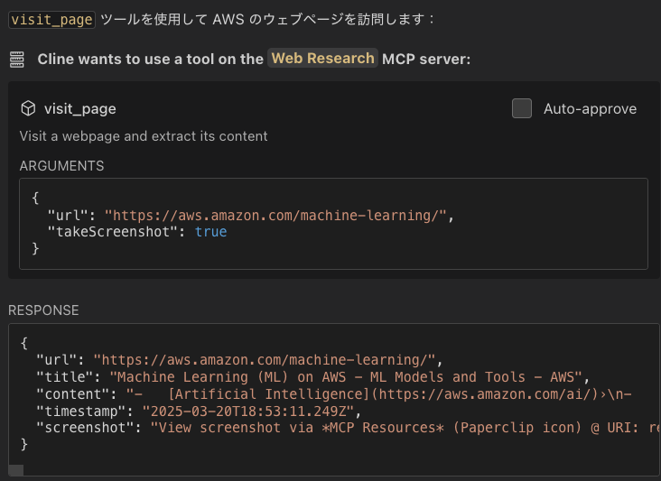
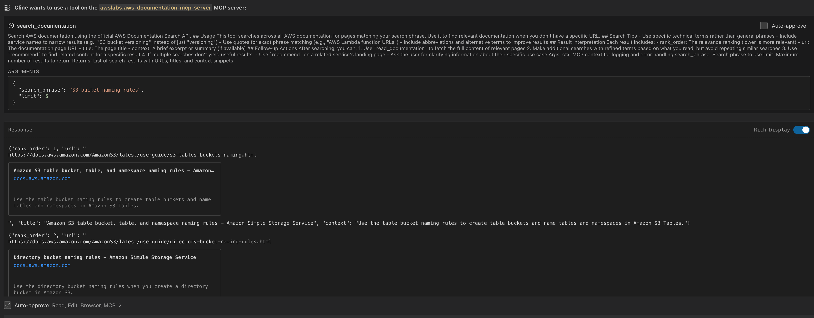
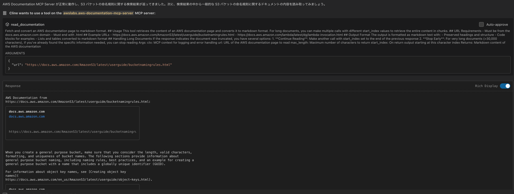

# MCP（Model Context Protocol）ワークショップ

このワークショップでは、[Model Context Protocol (MCP)](https://modelcontextprotocol.io/introduction) を使用して AI エージェントの機能を拡張し、外部 API やサービスと連携する方法を学びます。

## MCP の基本概念

MCP は、AI モデルとデータソースやツールを接続するための標準化されたオープンプロトコルです。USB-C のように、異なるシステム間の互換性を確保する役割を果たします。

### MCP の本質と基本コンポーネント

MCP は以下の主要コンポーネントで構成されています：

1. **ツール（Tools）**
   - 特定の機能を実行するための実行可能なインターフェース
   - 明確な入力スキーマと出力形式を定義
   - エラーハンドリングの実装が必須

2. **リソース（Resources）**
   - AI モデルがアクセスできる静的または動的なデータソース
   - ドキュメント、API レスポンス、システム情報など
   - 静的または動的なデータを提供

3. **プロトコル定義**
   - クライアントとサーバー間の通信規約
   - 標準化されたリクエスト/レスポンス形式

### MCP がもたらす主なメリット

MCP は、LLM 上にエージェントや複雑なワークフローを構築するのに役立ちます：

1. **豊富な事前構築された統合**
   - LLM が直接プラグインできる、成長し続ける事前構築された統合のリスト
   - 様々なデータソースやツールとの迅速な接続が可能

2. **LLM プロバイダーとベンダー間の柔軟な切り替え**
   - 異なる LLM プロバイダーやベンダー間で簡単に切り替えることができる柔軟性
   - ベンダーロックインの回避と、最適な LLM の選択が可能

3. **インフラストラクチャ内でのデータセキュリティのベストプラクティス**
   - ユーザー自身のインフラ内でデータを安全に保持
   - センシティブな情報を外部に送信せずに処理可能

4. **相互運用性の向上**
   - 標準化されたインターフェースによる開発時間の短縮
   - 異なるシステム間での円滑な情報交換

## 環境要件

| 項目 | Amazon EC2 環境 | ローカル PC 環境 |
|-----|---------|--------------|
| Node.js | ✓ | 要インストール |
| TypeScript | ✓ | 要インストール |
| Python 3.10+ | ✓ | 要インストール |
| IAM Role | ✓ | ✓ |
| アクセスキー | ✓ | ✓ |

## 認証方式の選択

### 1. IAM Role を使用する場合（両環境対応）

**メリット：**
- 認証情報の管理が不要
- セキュリティ的に推奨
- 自動更新される

**設定手順：**
1. Amazon EC2 環境：インスタンスに適切な IAM ロールが割り当てられていることを確認
2. ローカル環境：AWS CLI の設定で IAM Role を使用するよう設定

### 2. アクセスキーを使用する場合（両環境対応）

**メリット：**
- どの環境でも利用可能
- 設定が簡単

**制限事項：**
- 認証情報の管理が必要
- 定期的な更新が必要
- セキュリティリスクの考慮が必要

**設定手順：**
1. AWS 認証情報を環境変数またはプロファイルで設定
2. MCP サーバーの設定ファイルで認証方式を指定

## MCP サーバーの活用

### 1. MCP Marketplace の活用

[MCP Marketplace](https://cline.bot/mcp-marketplace) は、AI エージェントの機能を拡張するための豊富なツールとリソースを提供します。Marketplace を通じて、様々な MCP サーバーを簡単に導入し、AI エージェントの能力を大幅に拡張することができます。

#### MCP Marketplace へのアクセス

MCP Marketplace にアクセスするには、VS Code の Cline 拡張機能を開き、左側のサイドバーから「MCP Servers」を選択し、画面上部の「Marketplace」タブをクリックします。


Marketplace では、キーワード検索を通じて必要なツールを見つけ、Cline 自身の能力でインストール作業を進めることができます。また、インストール済みのサーバーの設定管理や、最新バージョンへの更新も簡単に行えます。

#### MCP サーバー例

##### 1. Markdownify MCP

Markdownify MCP は、様々な形式のコンテンツを AI エージェントが理解しやすいマークダウン形式に変換します。PDF や Office ドキュメント、ウェブページ、さらには YouTube 動画の字幕まで、幅広いコンテンツを扱うことができます。

**主な機能：**
- PDF ファイルの要約
- Web ページの情報分析

##### 2. Context7 MCP

Context7 MCP は、AI エージェントが最新のライブラリドキュメントにアクセスできるようにする強力なツールです。従来の LLM が抱える以下の問題を解決します：

❌ 古いトレーニングデータに基づく古いコード例
❌ 実在しない API の誤った生成
❌ 古いパッケージバージョンに基づく一般的な回答

Context7 を使用することで：
✅ ソースから直接、最新のバージョン固有のドキュメントとコード例を取得
✅ プロンプトに直接、最新の情報を組み込み
✅ 常に最新の API 仕様に基づいた正確な回答を得られます

**使用方法：**

質問に `use context7` を追加するだけで、最新のドキュメントが自動的に取得されます：

```
Next.js の `after` 関数の使い方を教えて use context7
React Query でクエリを無効化する方法は？ use context7
NextAuth でルートを保護する方法は？ use context7
```

詳しい情報は [Context7 のライブラリページ](https://context7.com/libraries) で確認できます。

#### MCP サーバーの管理

MCP サーバーを活用するためには、適切な管理が重要です。VS Code の Cline 拡張機能の「MCP Servers」セクションでは、インストール済みのサーバーを一覧表示し、各サーバーの設定変更や有効/無効の切り替えを簡単に行うことができます。

サーバーの設定は、「Settings」アイコンから変更できます。また、一時的に特定のサーバーを無効にしたい場合は、トグルスイッチを使用して簡単に切り替えることができます。



#### セキュリティとプライバシーへの配慮

MCP サーバーの利用にあたっては、セキュリティとプライバシーへの適切な配慮が不可欠です：

1. **信頼性の確認**
   - 信頼できる開発者やコミュニティが提供する MCP サーバーのみを使用する
   - オープンソースの場合はコードの確認を行う

2. **データ保護**
   - 機密情報や個人情報の取り扱いに注意する
   - Web Research などのインターネットにアクセスする MCP サーバーを使用する際は特に注意が必要

3. **リソース管理**
   - ローカル AI モデルを使用する MCP サーバーはシステムリソースを大量に消費する可能性がある
   - システム要件の確認とリソース制限の設定を検討する

### 2. AWS MCP サーバーの導入と活用

[AWS MCP Servers](https://github.com/awslabs/mcp) は、AWS のベストプラクティスと豊富な情報資源を開発ワークフローに直接統合する革新的なツールです。AWS MCP Servers は、Cline の MCP Marketplace から導入することも、単独でインストールすることも可能です。

#### AWS MCP サーバーの種類

AWS は、開発者の生産性向上と AWS サービスの効果的な活用を支援するために、複数の MCP サーバーを提供しています。以下一例です:

1. **Core MCP Server**
   - AWS Labs MCP サーバー群の中心的な役割
   - 他の MCP サーバーの管理や調整、設定の一元化

2. **AWS Documentation MCP Server**
   - AWS の公式ドキュメントを効率的に検索、探索、活用
   - マークダウン形式での情報提供

3. **Amazon Bedrock Knowledge Bases Retrieval MCP Server**
   - Amazon Bedrock の知識ベースを効率的に活用
   - 自然言語クエリによる情報検索
   - 結果のフィルタリングやリランキング

#### AWS MCP サーバーの導入方法

##### 1. MCP Marketplace からの導入（推奨）

MCP Marketplace を通じて AWS MCP サーバーを導入する方法は、最も簡単で推奨される方法です：

1. VS Code の Cline 拡張機能を開き、左側のサイドバーから「MCP Servers」を選択
2. 画面上部の「Marketplace」タブをクリック
3. 検索バーに「AWS」と入力して検索
4. 表示された AWS MCP サーバーの「Install」ボタンをクリック
5. 画面の指示に従ってインストールを完了

この方法では、依存関係の管理や設定が自動的に行われるため、初心者にも簡単に導入できます。

##### 2. 単独での導入

より詳細な設定や特定のバージョンを使用したい場合は、単独でのインストールも可能です。
公式ドキュメントを参考にインストールしてください。

##### 開発環境の準備

まず、Python 3.10 以上と、パッケージ管理ツールである uv がインストールされていることを確認します。uv は [Astral](https://astral.sh/) または [GitHub](https://github.com/astral-sh/uv) からインストールできます。

##### AWS MCP サーバーのインストール

各 MCP サーバーは以下のコマンドでインストールできます：

**Core MCP Server**
```bash
uv pip install awslabs.core-mcp-server
```

**AWS Documentation MCP Server**
```bash
uv pip install awslabs.aws-documentation-mcp-server
```

##### MCP 設定ファイルの作成

インストール後、VS Code の設定から MCP Settings を開き、以下のような設定を追加します：

```json
{
  "mcpServers": {
    "awslabs.core-mcp-server": {
      "command": "uvx",
      "args": ["awslabs.core-mcp-server@latest"],
      "env": {
        "FASTMCP_LOG_LEVEL": "ERROR",
        "MCP_SETTINGS_PATH": "path to your mcp settings file",
        "AWS_SDK_LOAD_CONFIG": "1"
      }
    },
    "awslabs.aws-documentation-mcp-server": {
      "command": "uvx",
      "args": ["awslabs.aws-documentation-mcp-server@latest"],
      "env": {
        "FASTMCP_LOG_LEVEL": "ERROR",
        "AWS_SDK_LOAD_CONFIG": "1",
        "DOCS_CACHE_TTL": "3600"
      }
    }
  }
}
```

#### AWS MCP サーバーの実践的な活用例

AWS MCP サーバーの活用方法を具体的に理解するために、AWS Documentation MCP Server を使用して AWS S3 バケットの命名規則に関する情報を検索・取得する例を見てみましょう。

まず、S3 バケットの命名規則に関するドキュメントを検索します。Cline に対して、以下のように質問します：

```
AWS S3 バケットの命名規則について調べてください
```

Cline は内部的に AWS Documentation MCP Server の `search_documentation` ツールを使用して検索を行います：



検索結果から、最も関連性の高いドキュメントを選択し、その内容を取得します：



取得したドキュメントには、S3 バケットの命名規則に関する詳細な情報が含まれています：

- バケット名は 3 文字以上 63 文字以下である必要がある
- バケット名には小文字、数字、ピリオド (.)、ハイフン (-) のみを使用できる
- バケット名は文字または数字で始まり、文字または数字で終わる必要がある

このように、AWS Documentation MCP Server を使用することで、AWS のドキュメントを効率的に検索し、必要な情報を素早く取得することができます。

## セキュリティに関する注意事項

MCP サーバーを導入・実行する際には、以下のセキュリティ上の注意点に留意してください：

1. **信頼性の確認**
   - 組織内での MCP サーバー利用に関するポリシーや許可を事前に確認すること
   - 信頼できるソースから提供される MCP のみをインストールすること
   - オープンソースの MCP の場合、コードを確認してから使用すること

2. **データ保護**
   - 外部サイトへのアクセスを行う MCP は、情報漏洩のリスクがあることを認識すること
   - 機密情報や個人情報を扱う際は、適切なセキュリティ対策が施された MCP のみを使用すること
   - API キーなどの認証情報は環境変数として安全に管理すること

3. **アクセス制御**
   - MCP サーバーに必要最小限の権限のみを付与すること
   - `autoApprove` 設定は慎重に行い、信頼できるツールのみに許可すること
   - 定期的に MCP の動作やアクセス先を監査し、不審な挙動がないか確認すること

4. **リソース管理**
   - MCP サーバーのリソース使用状況を監視すること
   - 不要なサーバーは無効化または削除すること

---

**[次のステップ]**
- [LiteLLM ワークショップへ進む](./litellm.md)
- [ワークショップ一覧に戻る](./README.md)
