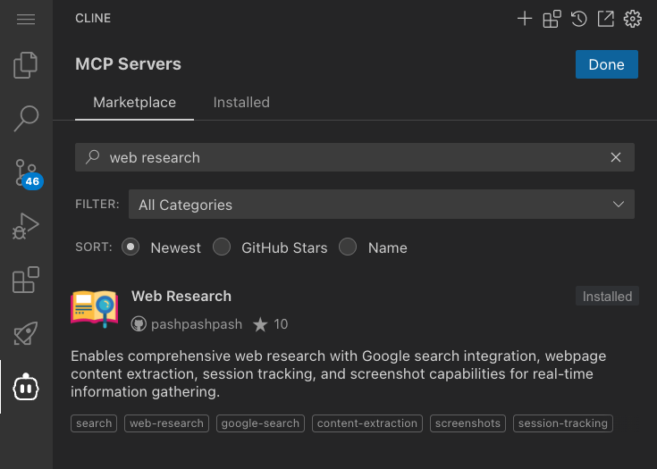

# MCP（Model Context Protocol）ワークショップ

このワークショップでは、[Model Context Protocol (MCP)](https://modelcontextprotocol.io/introduction) を使用して 
AI エージェントの機能を拡張し、外部 API やサービスと連携する方法を学びます。

## ドキュメント構成


## MCP の基本概念

MCP は、AI モデルとデータソースやツールを接続するための標準化されたオープンプロトコルです。USB-C のように、異なるシステム間の互換性を確保する役割を果たします。

### MCP の本質と基本コンポーネント

MCP は以下の主要コンポーネントで構成されています：


MCP は以下の主要コンポーネントで構成されています：

1. **ツール（Tools）**
   - サーバーが実行可能な機能をクライアントに公開
   - モデル制御型の設計（AI モデルが自動的に呼び出す）
   - 外部システムとの対話、計算の実行、実世界でのアクション実行を可能に

2. **リソース（Resources）**
   - AI モデルがアクセスできる静的または動的なデータソース
   - ドキュメント、API レスポンス、システム情報などを提供
   - URI によって一意に識別される

3. **プロンプト（Prompts）**
   - 再利用可能なプロンプトテンプレートとワークフローを定義
   - ユーザー制御型の設計（ユーザーが明示的に選択して使用）
   - 共通の LLM 対話を標準化し共有する方法を提供

4. **トランスポート（Transports）**
   - クライアントとサーバー間の通信方法を定義
   - Stdio（標準入出力）や HTTP/SSE（Server-Sent Events）などの通信方式
   - 環境や要件に応じて適切な通信方式を選択可能

### MCP コンポーネントの詳細

#### ツールの詳細

MCP におけるツールは、サーバーが実行可能な機能をクライアントに公開するための強力な基本要素です。
[ツールの詳細な仕様](https://modelcontextprotocol.io/docs/concepts/tools)は公式ドキュメントで確認できます。

ツールは **モデル制御型** の設計となっており、AI モデルが（人間の承認を得た上で）自動的に呼び出すことを意図してサーバーからクライアントに公開されます。
これにより、LLM は外部システムとの対話、計算の実行、実世界でのアクションの実行などが可能になります。

各ツールは以下の要素で定義されます：
- 名前：ツールを一意に識別する識別子
- 説明：ツールの使用方法を説明する人間可読な説明
- 入力スキーマ：ツールのパラメータを定義する JSON スキーマ
- アノテーション：ツールの動作に関するヒント（オプション）

ツールのアノテーションには以下のような情報が含まれます：
- タイトル：UI 表示用の人間可読なタイトル
- 読み取り専用ヒント：環境を変更しないツールかどうか
- 破壊的ヒント：破壊的な更新を行う可能性があるかどうか
- べき等性ヒント：同じ引数での繰り返し呼び出しが追加の効果を持たないかどうか
- オープンワールドヒント：外部エンティティとの対話を行うかどうか

クライアントは `tools/list` エンドポイントを通じて利用可能なツールを発見し、`tools/call` エンドポイントを使用してツールを呼び出します。
ツールは、システム操作、API 統合、データ処理など、様々な用途に使用できます。

ツールの実装においては、明確な名前と説明の提供、詳細な JSON スキーマ定義、適切なエラー処理、進捗報告、タイムアウト実装など、いくつかのベストプラクティスがあります。
また、セキュリティ面では、入力の検証、アクセス制御、監査ログの記録など、適切な対策を講じることが重要です。

#### リソースの詳細

MCP におけるリソースは、サーバーがクライアントに公開し、LLM との対話のコンテキストとして使用できるデータや内容を表現する重要な基本要素です。
[リソースの詳細な仕様](https://modelcontextprotocol.io/docs/concepts/resources)は公式ドキュメントで確認できます。

リソースは **アプリケーション制御型** の設計となっており、クライアントアプリケーションがいつどのようにリソースを使用するかを決定します。
リソースは URI によって一意に識別され、以下のような形式に従います：

```
[プロトコル]://[ホスト]/[パス]
```

例えば、`file:///home/user/documents/report.pdf` や `postgres://database/customers/schema` などがあります。これらの URI スキームはサーバー実装によって定義されます。

リソースには主に 2 種類のコンテンツタイプがあります：

1. **テキストリソース**：UTF-8 でエンコードされたテキストデータを含み、ソースコード、設定ファイル、ログファイルなどに適しています。

2. **バイナリリソース**：Base64 でエンコードされた生のバイナリデータを含み、画像、PDF、音声ファイルなどの非テキスト形式に適しています。

クライアントは主に 2 つの方法でリソースを発見できます。1 つ目は「直接リソース」で、サーバーが `resources/list` エンドポイントを通じて具体的なリソースのリストを公開します。
2 つ目は「リソーステンプレート」で、動的リソース用に URI テンプレートを公開し、クライアントが有効なリソース URI を構築できるようにします。

リソースの読み取りは、クライアントがリソース URI を含む `resources/read` リクエストを送信することで行われます。
サーバーはリソースの内容を含むレスポンスを返します。また、MCP はリソースのリアルタイム更新もサポートしており、リソースリストの変更通知やコンテンツの変更通知を提供します。

#### プロンプトの詳細

MCP におけるプロンプトは、再利用可能なプロンプトテンプレートとワークフローを定義する機能です。
[プロンプトの詳細な仕様](https://modelcontextprotocol.io/docs/concepts/prompts)は公式ドキュメントで確認できます。

プロンプトは **ユーザー制御型** の設計となっており、サーバーからクライアントに公開され、ユーザーが明示的に選択して使用することを意図しています。
これにより、共通の LLM 対話を標準化し、共有する強力な方法を提供します。

MCP のプロンプトは以下のような特徴を持っています：

- 動的な引数を受け入れる
- リソースからのコンテキストを含める
- 複数の対話をチェーンする
- 特定のワークフローをガイドする
- UI 要素（スラッシュコマンドなど）として表面化する

プロンプトの構造は、名前、説明、オプションの引数リストで定義されます。
クライアントは `prompts/list` エンドポイントを通じて利用可能なプロンプトを発見し、`prompts/get` リクエストを使用してプロンプトを利用します。

動的プロンプトでは、埋め込みリソースコンテキストや多段階ワークフローなど、より複雑な対話を実現できます。
これにより、プロジェクトログやコードの分析、デバッグワークフローなど、高度な AI アシスタンス機能を実装することが可能になります。

プロンプトの実装においては、明確で説明的なプロンプト名の使用、詳細な説明の提供、必須引数の検証、エラー処理の実装など、いくつかのベストプラクティスがあります。
また、セキュリティ面では、引数の検証、ユーザー入力のサニタイズ、アクセス制御の実装など、適切な対策を講じることが重要です。

#### トランスポートの詳細

MCP におけるトランスポートは、クライアントとサーバー間の通信方法を定義する重要な要素です。
[トランスポートの詳細な仕様](https://modelcontextprotocol.io/docs/concepts/transports)は公式ドキュメントで確認できます。

トランスポートは、MCP の通信層を抽象化し、異なる環境や要件に応じて適切な通信方式を選択できるようにします。主要なトランスポートタイプには以下があります：

- **Stdio（標準入出力）**: ローカル環境での通信に適しており、シンプルで効率的です。
- **HTTP/SSE（Server-Sent Events）**: リモート環境での通信に適しており、ウェブベースのアプリケーションとの統合が容易です。

トランスポートの選択は、以下の要因を考慮して行います：
- 通信の環境（ローカルかリモートか）
- セキュリティ要件
- スケーラビリティの必要性
- 既存のインフラストラクチャとの互換性

適切なトランスポートを選択することで、MCP の効率的な運用と、様々な環境での柔軟な展開が可能になります。

### MCP の一般的なアーキテクチャ

MCP は基本的にクライアント-サーバーアーキテクチャに従っており、ホストアプリケーションが複数のサーバーに接続できる構造になっています：


- **MCP ホスト**: Claude Desktop、IDE、AIツールなど、MCPを通じてデータにアクセスしたいプログラム
- **MCP クライアント**: サーバーとの1:1接続を維持するプロトコルクライアント
- **MCP サーバー**: 標準化されたModel Context Protocolを通じて特定の機能を公開する軽量プログラム
- **ローカルデータソース**: MCPサーバーが安全にアクセスできるコンピュータのファイル、データベース、サービス
- **リモートサービス**: MCPサーバーが接続できるインターネット経由の外部システム（APIなど）

### MCPのアーキテクチャ詳細

MCPの詳細なアーキテクチャについては、[公式ドキュメント](https://modelcontextprotocol.io/docs/concepts/architecture)で詳しく解説されています。ここでは主要な概念を簡潔に説明します。

MCP は主にプロトコル層とトランスポート層という 2 つの層で構成されています。
プロトコル層はメッセージの構造化と管理を担当し、リクエストとレスポンスの制御や通信パターンの標準化を行います。
一方、トランスポート層は実際の通信を処理し、ローカル環境では標準入出力を使用した通信、リモート環境では HTTP と Server-Sent Events (SSE) を組み合わせた通信を提供します。
すべての通信は JSON-RPC ベースのメッセージングプロトコルを使用して行われます。

MCP の通信システムは、明確に定義されたメッセージタイプに基づいています。
リクエストは相手側からの応答を期待する問い合わせであり、レスポンスはそのリクエストに対する回答です。
また、応答を必要としない一方向の通知も存在します。
これらのメッセージ交換は、初期化、通常のメッセージ交換、終了という 3 つのフェーズからなる接続ライフサイクルの中で行われます。

初期化フェーズでは、クライアントとサーバーが互いの機能とプロトコルバージョンを確認します。
通常のメッセージ交換フェーズでは、双方向の通信が行われ、最終的に正常または異常な形で接続が終了します。
また、MCP には標準化されたエラーコードと一貫したエラー報告メカニズム、適切なエラー回復手順が組み込まれており、安定した通信を実現しています。

より詳細な実装情報や高度な機能については、[アーキテクチャドキュメント](https://modelcontextprotocol.io/docs/concepts/architecture)を参照してください。

### MCP がもたらす主なメリット

MCP は、LLM 上にエージェントや複雑なワークフローを構築するのに役立ちます：

1. **豊富な事前構築された統合**
   - LLM が直接プラグインできる、成長し続ける事前構築された統合のリスト
   - 様々なデータソースやツールとの迅速な接続が可能

2. **LLM プロバイダーとベンダー間の柔軟な切り替え**
   - 異なる LLM プロバイダーやベンダー間で簡単に切り替えることができる柔軟性
   - ベンダーロックインの回避と、最適な LLM の選択が可能

3. **インフラストラクチャ内でのデータセキュリティのベストプラクティス**
   - ユーザー自身のインフラ内でデータを安全に保持
   - センシティブな情報を外部に送信せずに処理可能

4. **相互運用性の向上**
   - 標準化されたインターフェースによる開発時間の短縮
   - 異なるシステム間での円滑な情報交換

---

## MCP を実際に使ってみよう！(ここからワークショップ演習)

ここまで MCP の基本概念、コンポーネント、アーキテクチャについて学んできました。
これらの理論的な知識を踏まえて、実際に MCP を活用する方法を見ていきましょう。
MCP の真の価値は、それを実際のプロジェクトに組み込み、AI エージェントの能力を拡張することで発揮されます。

以下では、MCP Marketplace を通じた様々なサーバーの導入方法や、AWS MCP サーバーの活用例など、実践的な内容を紹介します。
これらの知識を活用することで、あなたの開発プロジェクトに MCP の強力な機能を簡単に取り入れることができるようになります。

### MCP Marketplace の活用

[MCP Marketplace](https://cline.bot/mcp-marketplace) は、AI エージェントの機能を拡張するための豊富なツールとリソースを提供します。
Marketplace を通じて、様々な MCP サーバーを簡単に導入し、AI エージェントの能力を大幅に拡張することができます。

### MCP Marketplace へのアクセス

MCP Marketplace にアクセスするには、VS Code の Cline 拡張機能を開き、左側のサイドバーから「MCP Servers」を選択し、画面上部の「Marketplace」タブをクリックします。



Marketplace では、キーワード検索を通じて必要なツールを見つけ、Cline 自身の能力でインストール作業を進めることができます。
また、インストール済みのサーバーの設定管理や、最新バージョンへの更新も簡単に行えます。

### ワークショップ 1: Context7 MCP

Context7 MCP は、AI エージェントが最新のライブラリドキュメントにアクセスできるようにする強力なツールです。従来の LLM が抱える以下の問題を解決します：

❌ 古いトレーニングデータに基づく古いコード例
❌ 実在しない API の誤った生成
❌ 古いパッケージバージョンに基づく一般的な回答

Context7 を使用することで：
✅ ソースから直接、最新のバージョン固有のドキュメントとコード例を取得
✅ プロンプトに直接、最新の情報を組み込み
✅ 常に最新の API 仕様に基づいた正確な回答を得られます

#### 使用方法

質問に `use context7` を追加するだけで、最新のドキュメントが自動的に取得されます：

```
Next.js の `after` 関数の使い方を教えて use context7
React Query でクエリを無効化する方法は？ use context7
NextAuth でルートを保護する方法は？ use context7
```

詳しい情報は [Context7 のライブラリページ](https://context7.com/libraries) で確認できます。

#### インストール方法

MCP Marketplace で "Install" を実行すると Cline がインストールのための新しいタスクを開始します。
Cline に委ねて作業を進めることができますが、以下に参考となる手順を示します。
以下の手順は変更になる可能性があるためあくまで参考とし、公式手順を参照してください。

```bash
mkdir -p /home/coder/Cline/MCP
cd /home/coder/Cline/MCP && mkdir -p context7-mcp
cd /home/coder/Cline/MCP/context7-mcp && npm install -g @upstash/context7-mcp@latest
```

MCP Setting ファイル `/home/coder/.vscode-server/data/User/globalStorage/saoudrizwan.claude-dev/settings/cline_mcp_settings.json` を編集する。

```json
{
  "mcpServers": {
    "github.com/upstash/context7-mcp": {
      "autoApprove": [],
      "disabled": false,
      "timeout": 60,
      "command": "/home/coder/.local/share/mise/shims/npx",
      "args": [
        "-y",
        "@upstash/context7-mcp@latest"
      ],
      "transportType": "stdio"
    }
  }
}
```

### ワークショップ 2. AWS MCP サーバーの導入と活用

[AWS MCP Servers](https://github.com/awslabs/mcp) は、AWS のベストプラクティスと豊富な情報資源を開発ワークフローに直接統合する革新的なツールです。
AWS MCP Servers は、Cline の MCP Marketplace から導入することも、単独でインストールすることも可能です。

#### AWS MCP サーバーの種類

AWS は、開発者の生産性向上と AWS サービスの効果的な活用を支援するために、複数の MCP サーバーを提供しています。以下一例です:

1. **Core MCP Server**
   - AWS Labs MCP サーバー群の中心的な役割
   - 他の MCP サーバーの管理や調整、設定の一元化

2. **AWS Documentation MCP Server**
   - AWS の公式ドキュメントを効率的に検索、探索、活用
   - マークダウン形式での情報提供

3. **Amazon Bedrock Knowledge Bases Retrieval MCP Server**
   - Amazon Bedrock の知識ベースを効率的に活用
   - 自然言語クエリによる情報検索
   - 結果のフィルタリングやリランキング

#### AWS MCP サーバーの導入方法

1. VS Code の Cline 拡張機能を開き、左側のサイドバーから「MCP Servers」を選択
2. 画面上部の「Marketplace」タブをクリック
3. 検索バーに「AWS」と入力して検索
4. 表示された AWS MCP サーバーの「Install」ボタンをクリック
5. 画面の指示に従ってインストールを完了

#### 開発環境の準備

まず、Python 3.10 以上と、パッケージ管理ツールである uv がインストールされていることを確認します。
Amazon EC2 環境では uv は既にインストールされています。ローカル環境の場合もここまでの手順ですでにインストールされているはずです。

#### AWS MCP サーバーのインストール

MCP サーバーは以下のコマンドでインストールできます：

```
**AWS Documentation MCP Server**
```bash
mkdir -p /home/coder/Cline/MCP/aws-documentation-mcp-server
```

##### MCP 設定ファイルの作成

インストール後、Cline の設定から MCP Settings を開き、以下のような設定を追加します：

Settings ファイル: `/home/coder/.vscode-server/data/User/globalStorage/saoudrizwan.claude-dev/settings/cline_mcp_settings.json`

```json
{
  "mcpServers": {
    "github.com/upstash/context7-mcp": {
      "autoApprove": [],
      "disabled": false,
      "timeout": 60,
      "command": "/home/coder/.local/share/mise/shims/npx",
      "args": [
        "-y",
        "@upstash/context7-mcp@latest"
      ],
      "transportType": "stdio"
    },
    "github.com/awslabs/mcp/tree/main/src/aws-documentation-mcp-server": {
      "command": "/home/coder/.local/share/mise/shims/uvx",
      "args": ["awslabs.aws-documentation-mcp-server@latest"],
      "env": {
        "FASTMCP_LOG_LEVEL": "ERROR"
      },
      "disabled": false,
      "autoApprove": []
    }
  }
}
```

#### AWS MCP サーバーの使用例

AWS MCP サーバーの活用方法を具体的に理解するために、AWS Documentation MCP Server を使用して AWS S3 バケットの命名規則に関する情報を検索・取得する例を見てみましょう。

まず、S3 バケットの命名規則に関するドキュメントを検索します。Cline に対して、以下のように質問します：

```
AWS S3 バケットの命名規則について調べてください
```

Cline は内部的に AWS Documentation MCP Server の `search_documentation` ツールを使用して検索を行います：


検索結果から、最も関連性の高いドキュメントを選択し、その内容を取得します：


取得したドキュメントには、S3 バケットの命名規則に関する詳細な情報が含まれています：

- バケット名は 3 文字以上 63 文字以下である必要がある
- バケット名には小文字、数字、ピリオド (.)、ハイフン (-) のみを使用できる
- バケット名は文字または数字で始まり、文字または数字で終わる必要がある

このように、AWS Documentation MCP Server を使用することで、AWS の最新ドキュメントを効率的に検索し、必要な情報を素早く取得することができます。

### MCP サーバーの管理

MCP サーバーを活用するためには、適切な管理が重要です。
VS Code の Cline 拡張機能の「MCP Servers」セクションでは、インストール済みのサーバーを一覧表示し、各サーバーの設定変更や有効/無効の切り替えを簡単に行うことができます。

サーバーの設定は、「Settings」アイコンから変更できます。また、一時的に特定のサーバーを無効にしたい場合は、トグルスイッチを使用して簡単に切り替えることができます。


## トラブルシューティング

### 1. Shell Integration Unavailable エラー

VS Code のシェル統合機能が正しく設定されていない場合、「Shell Integration Unavailable」エラーが表示されることがあります。

**解決方法：**
以下のコマンドを `~/.bashrc` ファイルに追加してください：

```bash
[[ "$TERM_PROGRAM" == "vscode" ]] && . "$(code --locate-shell-integration-path bash)"
```

その後 `source ~/.bashrc` を実行してください。詳細については、[Cline Wiki のトラブルシューティングページ](https://cline.bot/wiki/troubleshooting)を参照してください。

### 2. コマンドパスの問題

MCP サーバーの設定で、`command` フィールドにコマンド名のみを指定すると、以下のようなエラーが発生する場合があります：

```
spawn uvx ENOENT
spawn node ENOENT
```

この問題は、特に mise を使用している環境で発生することが確認されています。

**解決策：**
mise 環境では、`/home/coder/.local/share/mise/shims/` ディレクトリ内のコマンドへのフルパスを指定することで解決できます。

例：
```json
{
  "mcpServers": {
    "github.com/upstash/context7-mcp": {
      "autoApprove": [],
      "disabled": false,
      "timeout": 60,
      "command": "/home/coder/.local/share/mise/shims/npx",
      "args": [
        "-y",
        "@upstash/context7-mcp@latest"
      ],
      "transportType": "stdio"
    }
  }
}
```

フルパスは `which コマンド名` で確認できます：
```bash
which npx
/home/coder/.local/share/mise/shims/npx

which uvx
/home/coder/.local/share/mise/shims/uvx
```

### 3. Terminal output capture failure

コマンド実行自体はできても出力をうまく得られないバグが v3.15.0 で発生します。[Issue #3445](https://github.com/cline/cline/issues/3445)
v3.14 では発生しないため、Cline 利用時にはバージョン指定でのインストールをお勧めします。

## セキュリティに関する注意事項

MCP サーバーを導入・実行する際には、以下のセキュリティ上の注意点に留意してください：

1. **信頼性の確認**
   - 組織内での MCP サーバー利用に関するポリシーや許可を事前に確認すること
   - 信頼できるソースから提供される MCP のみをインストールすること
   - オープンソースの MCP の場合、コードを確認してから使用すること

2. **データ保護**
   - 外部サイトへのアクセスを行う MCP は、情報漏洩のリスクがあることを認識すること
   - 機密情報や個人情報を扱う際は、適切なセキュリティ対策が施された MCP のみを使用すること
   - API キーなどの認証情報は環境変数として安全に管理すること

3. **アクセス制御**
   - MCP サーバーに必要最小限の権限のみを付与すること
   - `autoApprove` 設定は慎重に行い、信頼できるツールのみに許可すること
   - 定期的に MCP の動作やアクセス先を監査し、不審な挙動がないか確認すること

4. **リソース管理**
   - MCP サーバーのリソース使用状況を監視すること
   - 不要なサーバーは無効化または削除すること

---

**[次のステップ]**
- [LiteLLM ワークショップへ進む](./litellm.md)
- [ワークショップ一覧に戻る](./README.md)
