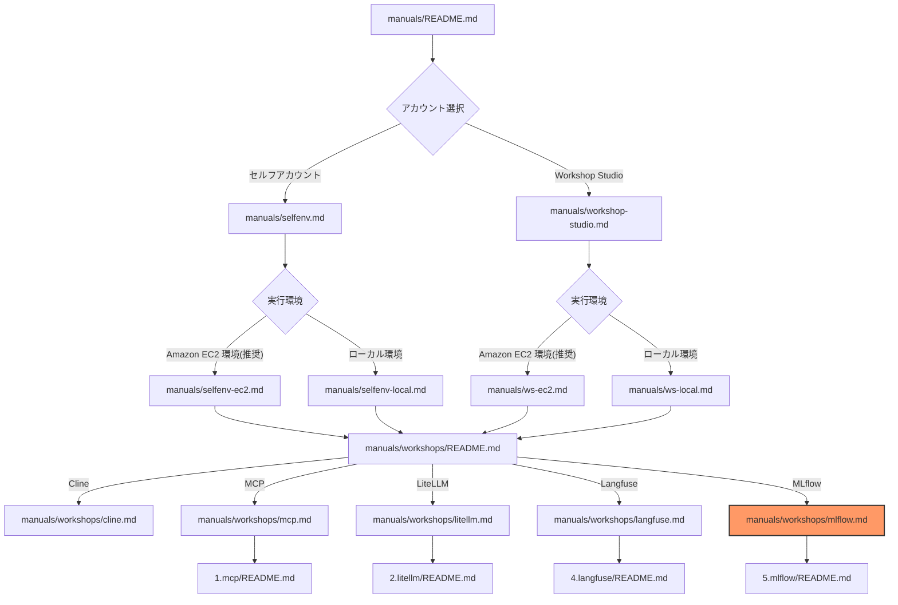
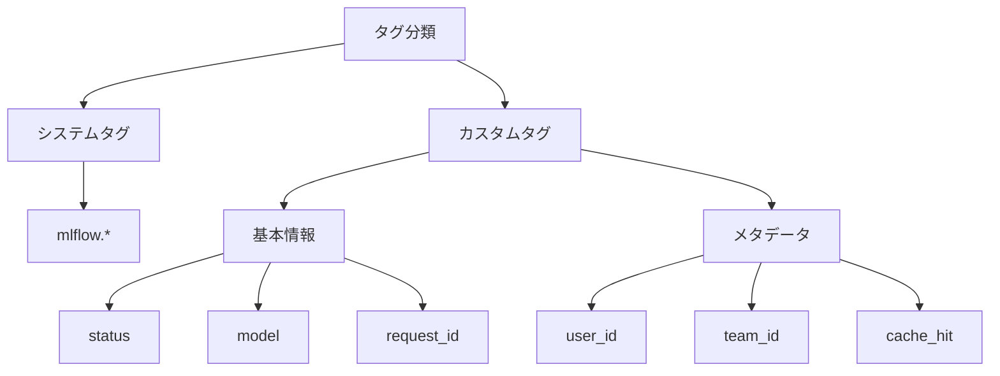
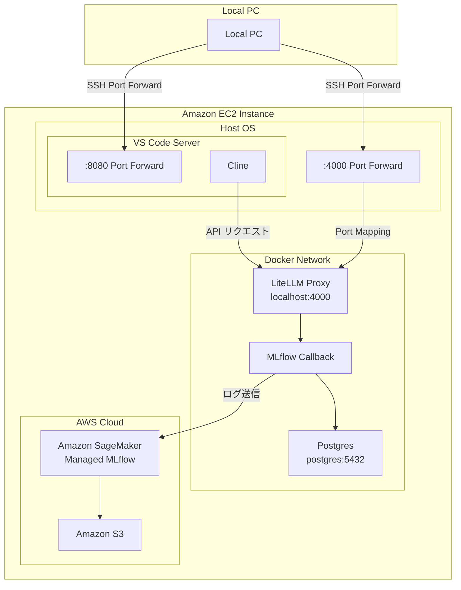

# MLflow ワークショップ

このワークショップでは、MLflow を使用して Cline with LiteLLM Proxy の使用状況を可視化し、AI 応答のモニタリングとコスト追跡を行う方法を学びます。

## ドキュメント構成



## MLflow 機能紹介

[MLflow](https://mlflow.org/) は、機械学習のライフサイクル全体を管理するためのオープンソースプラットフォームです。このワークショップでは、Amazon SageMaker の Amazon SageMaker Managed Service for MLflow を使用して、LiteLLM Proxy の実行ログを収集・分析します。

### 主要機能

1. **統合的なログ管理**
   - LLM の呼び出し履歴を一元管理
   - リクエスト/レスポンスの詳細な記録
   - コスト、レイテンシ、トークン使用量の追跡

2. **高度な分析機能**
   - MLflow の実験管理機能を活用
   - タグベースでの検索・フィルタリング
   - メトリクスの可視化とトレンド分析

3. **運用効率の向上**
   - マネージドサービスによる運用負荷の軽減
   - スケーラブルなログストレージ
   - セキュアなアクセス制御

### メトリクス記録

- **基本メトリクス**
  - レイテンシ（ミリ秒）
  - トークン使用量（prompt/completion/total）
  - コスト（USD）

- **カスタムメトリクス**
  - キャッシュヒット率
  - エラー率
  - モデルごとの使用状況

### タグ管理



## アーキテクチャ概要

### コンポーネント構成



### CDK スタック構成

MLflow の環境は AWS CDK を使用して構築されています：

1. **Amazon S3 バケット**
   - MLflow のアーティファクト保存用
   - 暗号化: Amazon S3 マネージド暗号化
   - バージョニング有効化

2. **AWS Identity and Access Management (IAM) ロール**
   - MLflow サーバー用の実行ロール
   - Amazon S3 バケットへの読み書き権限

3. **MLflow トラッキングサーバー**
   - サイズ: Small
   - アーティファクトストア: 作成した Amazon S3 バケット
   - IAM ロール: 作成したサーバー実行ロール

## 環境別のセットアップ手順

作業ディレクトリに移動してください。
事前に 2.litellm が実施されていることを前提としており、LiteLLM Proxy と MLflow の疎通を行います。

```bash
cd ~/aws-samples/workshops/ai-coding-workshop/cline/5.mlflow
```

### Amazon EC2 環境の場合（推奨）

1. **環境変数ファイルの準備**
```bash
cp .env.example .env
```

2. **CDK のセットアップ**
```bash
cd cdk
npm install
npm run build
npx cdk bootstrap
```

3. **CDK スタックのデプロイ**
```bash
npx cdk deploy
```

4. **MLflow の起動**
```bash
./manage-mlflow.sh start
```

### ローカル PC 環境の場合

1. **環境変数ファイルの準備**
```bash
cp .env.example .env
```

2. **AWS 認証情報の設定**
```bash
# .env
AWS_ACCESS_KEY_ID="your-access-key"
AWS_SECRET_ACCESS_KEY="your-secret-key"
AWS_DEFAULT_REGION="us-east-1"
```

3. **CDK のセットアップとデプロイ**
```bash
cd cdk
npm install
npm run build
npx cdk bootstrap
npx cdk deploy
```

4. **MLflow の起動**
```bash
./manage-mlflow.sh start
```

### LiteLLM Proxy の設定更新

MLflow との連携を有効にするために、LiteLLM Proxy の設定を更新します：

```bash
./manage-mlflow.sh update-config
```

## MLflow 管理画面（Web UI）

### アクセス方法

MLflow UI にアクセスするには、Amazon SageMaker の presigned URL を使用します。この URL は一時的な認証付きアクセスを提供します。

1. **presigned URL の取得**
```bash
./manage-mlflow.sh get-url
```

実行例：
```
[INFO] MLflow presigned URL: https://t-xxxxx.us-east-1.experiments.sagemaker.aws/auth?authToken=eyJhbGciOiJIUzI1NiJ9...
```

2. **URL の有効期限**
- 最小値: 5 秒
- 最大値: 5 分（300 秒）
- デフォルト: 300 秒
- URL は 1 回のみ使用可能

3. **セッション有効期限**
- 設定値: 20000 秒（約 5.5 時間）
- 制限値：
  - 最小値: 30 分（1800 秒）
  - 最大値: 12 時間（43200 秒）
  - デフォルト: 12 時間

### 主要な画面と機能

1. **実験管理**
   - プロンプトの実験記録
   - パラメータの追跡
   - 結果の比較

2. **メトリクス追跡**
   - 応答時間の計測
   - トークン使用量の記録
   - コストの計算

3. **アーティファクト管理**
   - プロンプトテンプレートの保存
   - 応答結果の保存
   - モデル設定の管理

4. **ダッシュボード**
   - リアルタイムモニタリング
   - トレンド分析
   - アラート設定

## トラブルシューティング

### 1. span 関連エラーの問題

span 関連でエラーが発生する場合があります：

```bash
litellm-1   | 2025/04/18 17:30:41 DEBUG mlflow.tracing.utils: Failed to get attribute mlflow.experimentId...
```

このエラーは動作に影響を与えませんが、今後のアップデートで修正される予定です。

### 2. 接続エラー

接続エラーが発生した場合は、以下を確認してください：

```bash
# トラッキングサーバー情報の確認
./manage-mlflow.sh get-tracking-info

# 認証情報の確認
aws sts get-caller-identity
```

### 3. ログ記録の問題

ログ記録に問題がある場合は、テストを実行して確認できます：

```bash
./manage-mlflow.sh test
```

---

**[次のステップ]**
- [ワークショップ一覧に戻る](./README.md)
