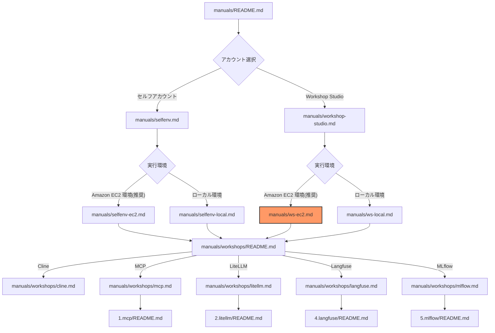
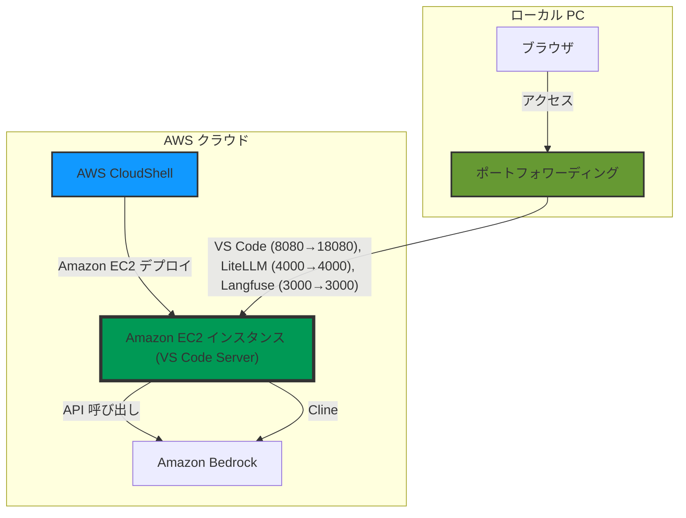
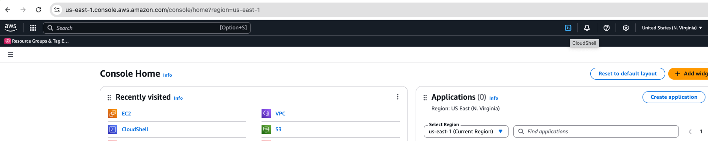

# Amazon EC2 上での VS Code 環境セットアップ

このガイドでは Amazon EC2 環境上で VS Code をセットアップする手順を説明します。

**目的と学習内容**：
このガイドでは、AI コーディングエージェントを効果的に活用するための基盤となる Amazon EC2 開発環境を構築します。AWS のクラウド環境と VS Code Server を組み合わせることで、安全な開発環境を実現する方法を学びます。

## ドキュメント構成



## 作業環境の概要

以下の 3 つの環境を使い分けて作業を進めます。各環境の役割と実施する作業を明確にすることで、スムーズにハンズオンを進めることができます。



### 各環境での作業内容

1. **AWS CloudShell**
   - **目的**: Amazon EC2 インスタンスの起動のみ
   - **作業**: AWS CloudFormation テンプレートのデプロイ
   - **特徴**: 権限が既に設定されており、誤って別環境にデプロイするリスクを回避できます

2. **ローカル PC**
   - **目的**: ポートフォワーディングの設定のみ
   - **作業**: 以下のポートフォワーディングを設定
     - VS Code Server: 8080 → 18080
     - LiteLLM: 4000 → 4000
     - Langfuse: 3000 → 3000
   - **注意点**: 一定時間接続がないとポートフォワーディングが終了するため、必要に応じてコマンドを再実行してください

3. **Amazon EC2 上の VS Code Server**
   - **目的**: 実際のハンズオン作業の実施
   - **作業**: Cline のセットアップ、LiteLLM Proxy の設定、Langfuse によるログ分析など
   - **アクセス方法**: ローカル PC のブラウザから http://localhost:18080 にアクセス

この環境構成により、AWS の権限管理を適切に行いながら、効率的にハンズオンを進めることができます。

## AWS CloudFormation テンプレートのデプロイ

### 1. AWS マネジメントコンソールにログイン

[AWS マネジメントコンソール](https://console.aws.amazon.com/) にログインします。

### 2. AWS CloudShell を起動

AWS CloudShell は AWS マネジメントコンソールから直接利用できる、ブラウザベースのシェル環境です。コンソール右上の AWS CloudShell アイコンをクリックして起動できます。



### 3. AWS CloudShell 内に AWS CloudFormation テンプレートをダウンロード

```
curl -O https://raw.githubusercontent.com/littlemex/aws-samples/main/workshops/ai-coding-workshop/cline/0.setup/cfn/ec2-ssm.yml
```

### 4. AWS CloudFormation スタックをデプロイ

リソース名の重複を防ぐため、任意の USERNAME を設定します。
なお、AWS CloudFormation のスタック名にはアンダースコア（_）を使用できないため、USERNAME にはハイフン（-）を使用してください。

```bash
export USERNAME=cline-sample
```

```bash
aws cloudformation deploy \
  --template-file ec2-ssm.yml \
  --stack-name ai-workshop-${USERNAME} \
  --parameter-overrides \
    UserName=${USERNAME} \
    Environment=dev \
  --capabilities CAPABILITY_NAMED_IAM
```

※ EC2 インスタンスの起動には 5 分程度かかります。

### 5. スタック出力の確認

```bash
aws cloudformation describe-stacks \
  --stack-name ai-workshop-${USERNAME} \
  --query 'Stacks[0].Outputs' \
  --output table
```

スタックの出力で `PortForwardCommand` が確認できるはずです。次の作業ためにメモしておきましょう。

## Amazon EC2 インスタンスへの接続

### 1. ローカル PC でのツールインストール

1. AWS CLI がローカル PC にインストールされていることを確認してください。
   ```bash
   aws --version
   ```

2. 追加でローカル PC に [AWS CLI 用の AWS Session Manager プラグインをインストール](https://docs.aws.amazon.com/ja_jp/systems-manager/latest/userguide/session-manager-working-with-install-plugin.html) してください。

### 2. AWS CLI の設定と動作確認

Windows, Mac, Linux など OS によらず以下のコマンドを実行できます。Windows の場合は WSL2 または PowerShell で実行してください。

1. **認証情報の設定**:
   ```bash
   # default のプロファイルが既にある場合に上書きをしないために既存の ~/.aws/{credenatials,config} の profile 名と競合しない profile 名にしてください。
   # 必ず以下の環境変数を設定してください。
   export AWS_PROFILE=cline

   # IAM ユーザーの場合
   aws configure

   # または IAM Identity Center (SSO) の場合
   aws configure sso
   ```

2. **プロファイル設定の確認**:

   プロファイルの設定内容は `~/.aws/config` または `~/.aws/credentials` に保存されます。

   ```bash
   # 設定されているプロファイルの一覧を表示
   aws configure list-profiles
   ```

3. **AWS SSM コマンドの動作確認**:
   ```bash
   aws sts get-caller-identity
   ```
   
   正常に動作すると、以下のような情報が表示されます：
   ```json
   {
       "UserId": "XXXXXXXXXXXXXXXXXXXXX",
       "Account": "123456789012",
       "Arn": "arn:aws:iam::123456789012:user/username"
   }
   ```

### 3. ポートフォーワーディング

スタックの出力 `PortForwardCommand` をローカル PC で実行しましょう。
ワークショップ当日、ローカル PC の OS の違いによる主な違いはポートフォワーディングコマンド形式です。

1. Mac/Linux の場合
   ```bash
   aws ssm start-session \
      --target <インスタンス ID> \
      --document-name AWS-StartPortForwardingSession \
      --parameters '{"portNumber":["8080"],"localPortNumber":["18080"]}'
   ```
2. Windows PowerShell の場合
   ```powershell
   aws ssm start-session `
      --target <インスタンス ID> `
      --document-name AWS-StartPortForwardingSession `
      --parameters '{\"portNumber\":[\"8080\"],\"localPortNumber\":[\"18080\"]}'
   ```
3. 実行結果

   成功した場合は
   ```bash
   Starting session with SessionId: {セッションID}
   Port 18080 opened for sessionId {セッションID}
   ```
   と出力されます。
4. ブラウザに localhost:18080 を入力して VS Code Server にアクセスします。

   無事 VS Code が表示されれば Amazon EC2 インスタンスへの接続は成功です！

主な OS による `aws ssm start-session` コマンドの違い:
1. 行継続文字: Mac/Linux では `\`、Windows PowerShell では `` ` `` (バッククォート)
2. JSON 文字列内のクォート: Windows PowerShell では `\"` でエスケープ

## VS Code の初期設定

1. リポジトリのダウンロードと展開
   ```bash
   # バージョンを環境変数で指定（講師の指示に従ってください）
   # 指示がない場合は heads/main を使用
   # バージョン指定例: export VERSION="tags/v0.0.3"
   export VERSION=${VERSION:-heads/main}
   
   # リポジトリのダウンロードと展開
   curl -L -o aws-samples.zip https://github.com/littlemex/aws-samples/archive/refs/${VERSION}.zip && unzip -d aws-samples aws-samples.zip && mv aws-samples/*/* aws-samples/
   
   # 展開されたディレクトリに移動
   cd aws-samples/workshops/ai-coding-workshop/cline
   ```

2. VS Code でフォルダを開く
   - 左サイドバーのエクスプローラーアイコンをクリック
   - 「フォルダを開く」をクリック
   - `/home/coder/aws-samples/workshops/ai-coding-workshop/cline` フォルダを選択して開く

3. 必要なパッケージのインストールとその確認

   ここまでがうまくいけば Cline を使うための開発環境構築は完了です！
   ```bash
   mise ls && mise install && uv --version
   docker -v
   ```

## トラブルシューティング

1. ポートフォワーディング
   ```bash
   An error occurred (TargetNotConnected) when calling the StartSession operation: {インスタンスID} is not connected.
   ```
   とエラーが出る場合は認証情報を確認し、数分待ちます。以前接続できない場合にはマネジメントコンソールからインスタンスを再起動してください。

---

**[次のステップ]**
- [ワークショップ一覧へ進む](./workshops/README.md)
- [戻る](./workshop-studio.md)
