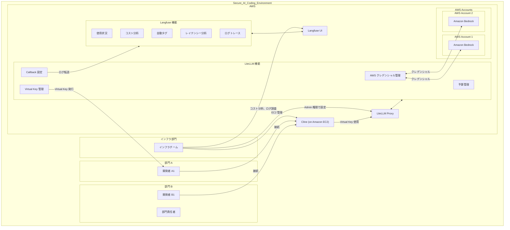
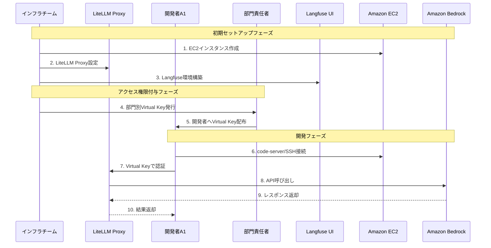
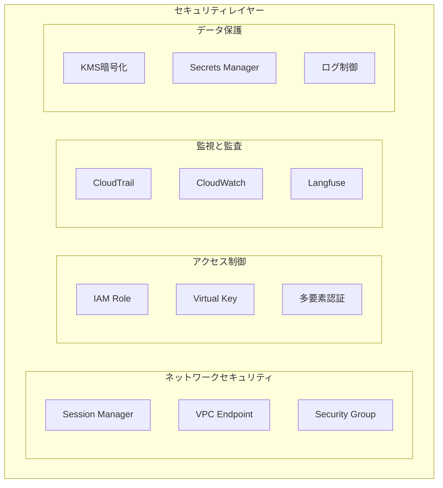
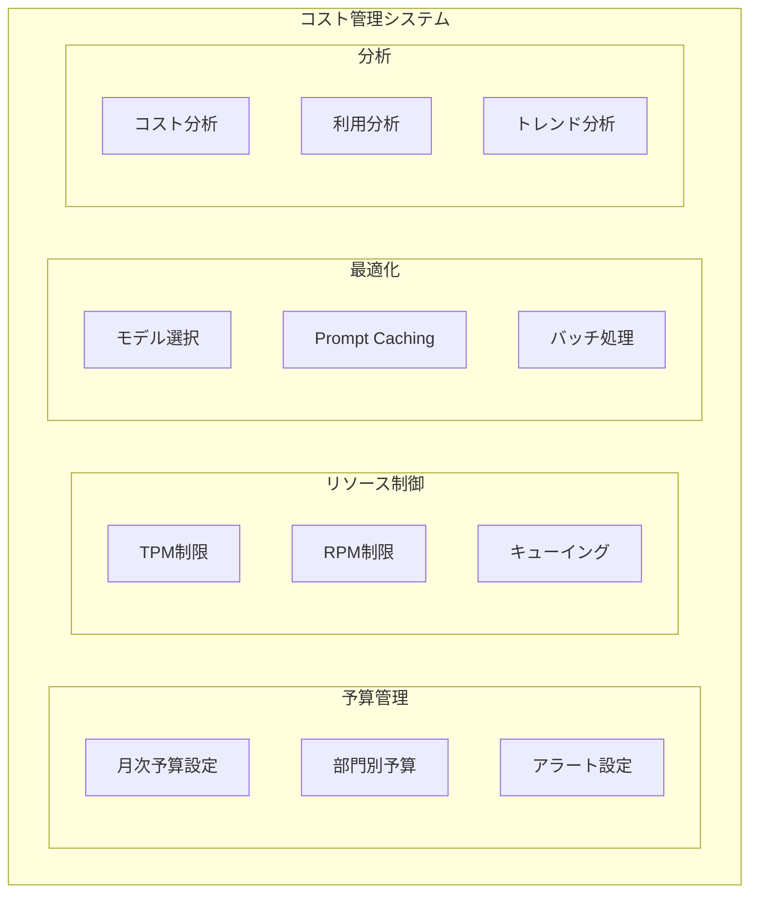

# AI コーディング支援エージェント時代における開発生産性とガバナンスの両立

## プレゼンテーション

2025年4月

---

## アジェンダ

- AI コーディング支援エージェントの概要と課題
- Cline の特徴と基本機能
- アーキテクチャ設計と実装
- セキュリティとアクセス制御
- コスト管理とリソース最適化
- 運用フローと実践的な導入方法

---

## AI コーディング支援エージェントの現状

**AI コーディング支援エージェント**は、開発の世界に革新的な変化をもたらしています：

- 単なるコード補完を超えた **自律的なタスク実行**
- プロジェクト全体の **コンテキスト理解**
- 複雑な開発タスクの **効率的な処理**
- チーム開発における **知識共有の促進**

*従来の開発手法では対応困難な課題に対応します*

---

## 企業が直面する主要な課題

### トークン消費と API 制限

- 複雑なコードベース理解による **大量のトークン消費**
- API Provider による **RPM/TPM 制限**
- 開発フローの中断リスク

### セキュリティとコンプライアンス

- 機密情報の保護要件
- 部門単位でのアクセス制御
- 監査対応とポリシー準拠

### コスト管理

- AI 利用コストの可視化と最適化
- 部門別予算管理と監視
- 効率的なモデル選択戦略

---

## Cline の概要

**Cline** は、開発者の意図を理解し自律的にタスクを実行できる AI コーディング支援エージェントです：

### 主要な特徴

- IDE への完全統合
- 自律的なタスク実行能力
- プロジェクト規約への適応
- オープンソースでの継続的進化

### 独自の機能

- **Pilot アプローチ**による自律的タスク遂行
- **Plan/Act モード**の分離による効率的な開発
- **Model Context Protocol** による高度な拡張性

---

## Amazon Bedrock と Claude 3.7 Sonnet の価値

### エンタープライズ環境への最適化

- AWS の「セキュリティファースト」哲学
- 包括的なコンプライアンス対応
- 豊富な実績と継続的な進化

### データ保護とプライバシー

- デフォルトでの学習無効化
- 詳細なデータ取り扱いポリシー設定
- 機密データの安全な処理

---

## 全体アーキテクチャ

セキュアな AI コーディング支援環境の全体像を示しています。

---

## アクセス制御とキー管理フロー

セキュアなアクセス制御と権限管理のフローを示しています。

---

## セキュリティ対策の実装

多層的なセキュリティ対策の実装構造を示しています。

---

## コスト管理とリソース制御

包括的なコスト管理とリソース制御の仕組みを示しています。

---

## 実装のポイント

### LiteLLM の設定

- Virtual Key 発行時の部門情報メタデータ付与
- Langfuse へのユーザー識別情報転送
- 部門ごとのクォータ設定

### Langfuse の設定

- 部門情報のタグ記録
- 部門別ダッシュボードの作成
- 全社データアクセス権設定

---

## 導入効果と期待される価値

### 開発生産性の向上

- コード生成時間の大幅削減
- プロジェクト理解の効率化
- チーム間の知識共有促進

### ガバナンスの強化

- セキュリティリスクの最小化
- コンプライアンス要件への適合
- 詳細な監査証跡の確保

### コスト最適化

- 予算管理の自動化
- リソース使用の効率化
- モデル選択の最適化

---

## まとめ

- AI コーディング支援エージェントの **効果的な活用**
- セキュリティと生産性の **両立**
- 組織全体での **持続可能な運用体制**
- **段階的な導入**と継続的な改善

*AI 時代における開発体制の新たなスタンダードを確立します*
