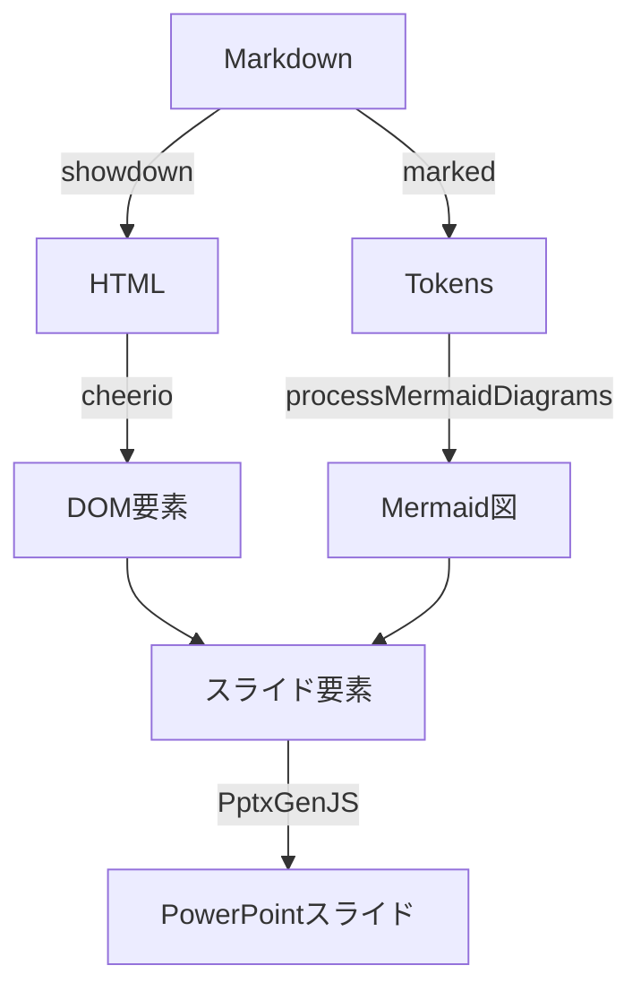

# PptxGenJS を使用したスライド生成

このディレクトリでは、PptxGenJS を使用して Markdown ファイルからスライドを生成するスクリプトを提供しています。

## セットアップ手順

### 2. 必要なパッケージとツールのインストール

#### Node.js パッケージのインストール

以下のパッケージをインストールしました：

- pptxgenjs: PowerPoint スライドを生成するためのライブラリ
- markdown-it: Markdown を解析するためのライブラリ

#### PDF 変換用ツールのインストール

PowerPoint ファイルを PDF に変換するために、以下のパッケージをインストールしました：

```bash
# LibreOffice と関連パッケージのインストール
sudo apt install libreoffice-common
sudo apt install default-jre libreoffice-java-common
sudo apt -y install libreoffice libreoffice-l10n-ja libreoffice-dmaths \
                    libreoffice-ogltrans libreoffice-writer2xhtml \
                    libreoffice-pdfimport libreoffice-help-ja
```

注意: インストール時にいくつかの警告が表示される場合がありますが、PDF 変換機能は正常に動作します。

```bash
# プロジェクトの初期化
npm init -y

# 必要なパッケージのインストール
npm install pptxgenjs markdown-it

# インストール結果
added 26 packages
found 0 vulnerabilities
```

## プロジェクト構造

```
slides/
├── README.md
├── package.json
├── package-lock.json
├── node_modules/
├── generate-html.js      # Markdown から HTML への変換
├── html-to-pptx.js      # HTML から PowerPoint への変換
├── preview.html         # 生成された HTML プレビュー
└── test.md             # テスト用 Markdown ファイル
```

## 実装状況

### 実装済みの機能

- [x] プロジェクトの初期化とパッケージのインストール
- [x] 基本的なスライド生成機能の実装
- [x] Markdown の見出しに基づくスライド分割
- [x] スライドマスターの基本設定
- [x] スライドデザインの改善（テーマ、カラースキーム、フォント）
- [x] 長いテキストの自動分割とフォーマット
- [x] プログレスバーの追加（スライド番号表示）
- [x] タイトルスライドの自動生成
- [x] Mermaid 図の画像変換と適切な配置
- [x] コードブロックの適切な表示（背景色、フォントサイズ）
- [x] 画像のアスペクト比維持

### 今後の改善予定

- [ ] スライドアニメーションの追加
- [ ] カスタムテーマの設定機能
- [ ] 複数の Mermaid 図の処理

### Markdown 処理の改善（進行中）

#### 実装済みの機能

- [x] Markdown リンクのハイパーリンク変換
  - リンクテキストとURL の適切な処理
  - クリック可能なハイパーリンクの生成
  - スタイリングの適用（色、下線など）

- [x] HTML ベースの高度な Markdown 処理
  - showdown による Markdown → HTML 変換
  - cheerio による HTML 解析
  - marked による Markdown トークン解析
  - 複雑な要素の適切な処理

#### 実装済みの機能（追加）

- [x] リンクを含むリストアイテムの適切な処理
  - リストアイテム内のリンクの抽出
  - リンクのスタイリング調整（色、下線）
  - インデントの最適化

- [x] 段落内のリンクの処理
  - リンク前後のテキストの分離
  - リンクのスタイリング（色、下線）
  - 複数リンクの適切な配置

#### 実装予定の機能

- [ ] 画像の処理
  - 画像の挿入と配置
  - サイズの自動調整
  - キャプションの追加

#### 技術スタック更新

新たに追加したパッケージとその役割：

1. **showdown**
   - 役割: Markdown を HTML に変換
   - 使用箇所: `markdown-converter.js` の `convert` メソッド
   - 特徴:
     - GitHub Flavored Markdown (GFM) をサポート
     - テーブル、タスクリスト、絵文字などの拡張機能
     - HTML 出力のカスタマイズが容易

2. **cheerio**
   - 役割: HTML の解析とDOM操作
   - 使用箇所: `markdown-converter.js` の `processDocument` メソッド
   - 特徴:
     - jQuery ライクな API でHTML要素の操作が可能
     - リンクやリストなどの要素を簡単に抽出
     - 要素間の関係性（親子、兄弟）を維持

3. **marked**
   - 役割: Markdown のトークン解析
   - 使用箇所: `markdown-converter.js` の Mermaid 図の抽出
   - 特徴:
     - 高速な Markdown パーサー
     - コードブロックの言語識別
     - カスタムレンダラーのサポート

#### ライブラリの連携フロー



各ライブラリの処理フロー：
1. showdown: Markdown → HTML 変換（リンク、リスト、段落の構造を保持）
2. cheerio: HTML解析 → DOM要素の抽出（リンクやリストの詳細情報を取得）
3. marked: Markdown → トークン解析（Mermaid図などの特殊ブロックを識別）
4. PptxGenJS: 変換された要素をスライドに配置

#### アーキテクチャの改善


1. **Markdown コンバーターモジュール**
   - `markdown-converter.js` の新規作成
   - HTML と AST のハイブリッド処理
   - 要素タイプごとの変換ロジック

2. **スライド生成の改善**
   - 要素タイプに応じた適切なレイアウト
   - リンクのスタイリング
   - 段落の適切な配置

3. **品質管理**
   - 単体テストの追加
   - 変換結果の検証
   - エラーハンドリングの強化

## 使用方法

### スライド生成スクリプトの実行

Markdown から PowerPoint スライドを生成するには、以下の2つのコマンドを順番に実行します：

```bash
# 1. Markdown から HTML への変換
node generate-html.js test.md

# 2. HTML から PowerPoint への変換
node html-to-pptx.js test-preview.html
```

このスクリプトは以下の処理を行います：

1. Markdown ファイルを HTML に変換
   - Mermaid 図を PNG 画像に変換
   - コードブロックの適切な書式設定
   - 画像の Base64 エンコード

2. HTML を PowerPoint に変換
   - 見出しごとにスライドを作成
   - 画像のアスペクト比を維持
   - コードブロックの背景色とフォント設定

### スクリプトの機能

- Markdown の見出しレベルに基づいたスライド分割
- Mermaid 図の処理（現在はテキストとして表示）
- スライドマスターの設定によるデザインの統一

### PDF への変換

生成された PowerPoint ファイルを PDF に変換するには、以下のコマンドを実行します：

```bash
libreoffice --headless --convert-to pdf output.pptx
```

注意: 変換時に以下のような警告やエラーメッセージが表示される場合がありますが、PDF は正常に生成されます：
```
Warning: failed to launch javaldx - java may not function correctly
error: xsltParseStylesheetFile : cannot parse
I/O warning : failed to load external entity
```

変換後、`output.pdf` ファイルが生成されます。
