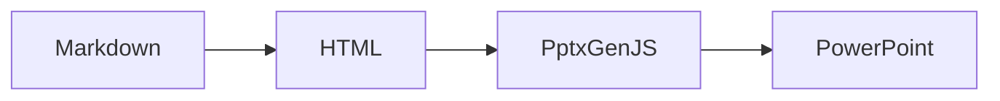

# リンク処理のテスト

このファイルは、Markdown のリンク処理をテストするためのものです。

## 通常のリンク

これは [PptxGenJS](https://gitbrent.github.io/PptxGenJS/) へのリンクです。

## リスト内のリンク

- [LiteLLM](https://github.com/BerriAI/litellm) は、様々な LLM プロバイダーに対応するライブラリです
- [Cline](https://github.com/cline-ai/cline) は、コマンドラインベースの AI アシスタントです
- 通常のテキストアイテム

## 段落内のリンク

これは段落内の [リンク](https://example.com) を含むテキストです。
複数の [リンク](https://example.org) を含む [段落](https://example.net) もテストします。

## コードブロック

```python
# これはコードブロックです
print("Hello, World!")
print("Hello, World2!")
```

## Mermaid 図



## テーブル

| 機能 | 説明 | 状態 |
|------|------|------|
| リンク変換 | Markdown のリンクを PowerPoint のハイパーリンクに変換 | ✅ |
| リスト処理 | 箇条書きとリンクの組み合わせに対応 | ✅ |
| Mermaid 図 | Mermaid 図を画像として変換 | ✅ |
| 自動改ページ | 長いコンテンツを複数のスライドに分割 | 🔄 |
| テーブル | Markdown テーブルを PowerPoint テーブルに変換 | 🔄 |

## 長いテキスト（自動改ページのテスト）

これは自動改ページのテストのための長いテキストです。このテキストは1つのスライドに収まらないほど長くなるように設計されています。

1. 最初の項目: PowerPoint スライドの生成
   - Markdown ファイルの読み込み
   - HTML への変換
   - スライドの作成
   - レイアウトの調整

2. 二番目の項目: リンクの処理
   - URL の抽出
   - ハイパーリンクの設定
   - スタイルの適用
   - クリック可能な状態の確認

3. 三番目の項目: 画像の処理
   - 画像ファイルの読み込み
   - サイズの調整
   - 配置の最適化
   - キャプションの追加

4. 四番目の項目: テーブルの処理
   - セルの結合
   - 罫線の設定
   - フォントの調整
   - 背景色の設定

5. 五番目の項目: スタイルの適用
   - カラーテーマの設定
   - フォントファミリーの選択
   - マージンの調整
   - アニメーションの追加

## サンプル画像


