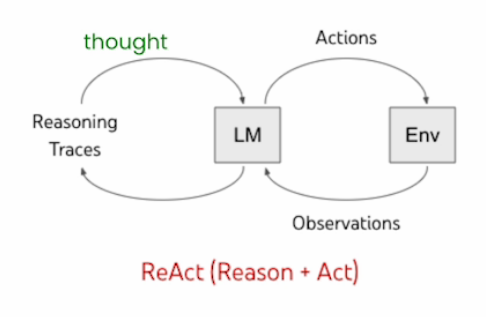
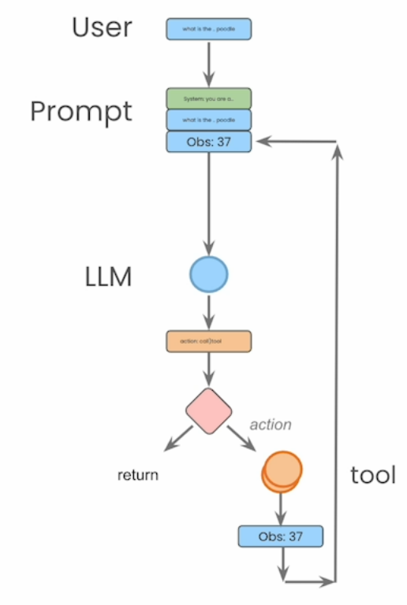

# Lab 1: 一からReActエージェントを構築する

Amazon BedrockとAnthropic社のClaudeモデルを使用して、一からReAct（Reasoning and Acting：推論と行動）エージェントを構築するこのセクションへようこそ。

ReActアプローチは、大規模言語モデル（LLM）の推論能力（例：chain-of-thought prompting）と行動能力（例：行動計画生成）を交互に組み合わせることを目指しています。これは論文[ReAct: Synergizing Reasoning and Acting in Language Models](https://arxiv.org/abs/2210.03629)で提案されました。

このセクション内のエージェントの構造は以下の図のようになっており、以下のコンポーネントで構成されています：
- ユーザー入力
- システムプロンプト
- 言語モデル
- 特定されたアクション
- アクションによって実行されるツール

さあ、始めましょう！