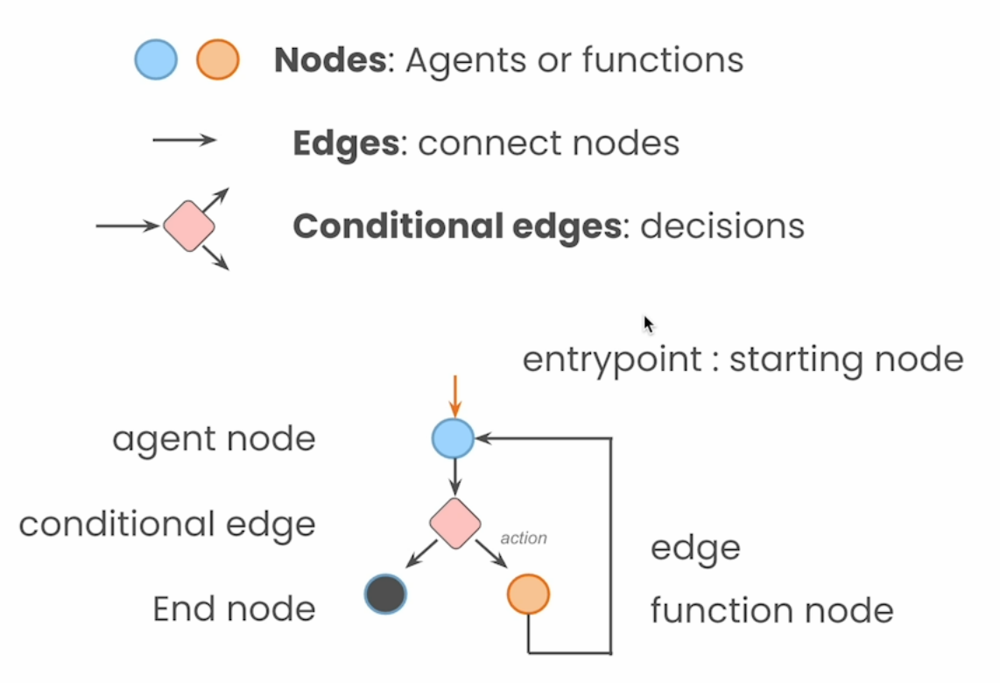

# Lab 2: LangGraphコンポーネント

LangGraph、AnthropicのClaudeモデル、Amazon Bedrockを使用したインテリジェントエージェントの実装に関するセクションへようこそ。前回のセッションでは、REACT（Reasoning and Acting）エージェントをゼロから実装する実践的なアプローチを取りました。この演習により、これらのエージェントがどのように動作し、意思決定を行うかについての基本的な理解を得ることができました。

今回は、大きな一歩を踏み出します。言語モデルを使用した構造化された会話と意思決定フローを作成するための強力なフレームワークであるLangGraphを活用します。すべてを一から構築する代わりに、LangGraphを使用してより洗練された柔軟なエージェントを作成します。また、言語モデルもアップグレードし、基本的な実装からAmazon Bedrockを介したAnthropicのClaudeモデルの使用に移行します。

このセクションでは、複雑な多段階のクエリを処理できる堅牢でスケーラブルなエージェントを作成する方法を示します。LangGraphが提供する構造がエージェントの機能をどのように強化するか、そしてClaudeの高度な機能とAmazon Bedrockのスケーラビリティが私たちの実装をどのように次のレベルに引き上げるかを見ることができます。
このセクションの終わりまでに、実世界のアプリケーション向けの最先端AIエージェントを作成するためにこれらのツールを使用する方法について明確な理解を得ることができるでしょう。

本質的に、LangGraphはグラフをサポートするLangChainの拡張です。単一および複数エージェントのワークフローはグラフとして記述および表現されます。このツールは、よく制御された「フロー」を可能にします。

LangGraphグラフのコンポーネントは、以下の画像に示されています。

さあ、始めましょう！