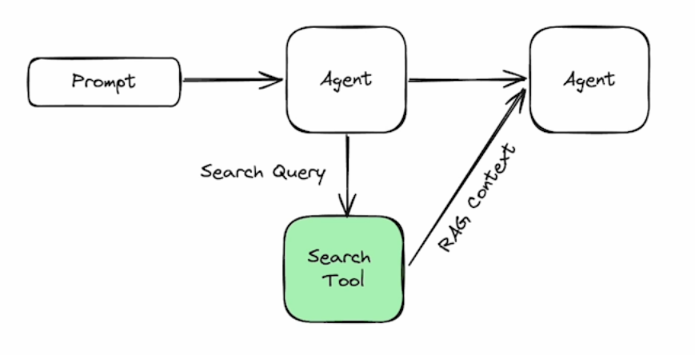
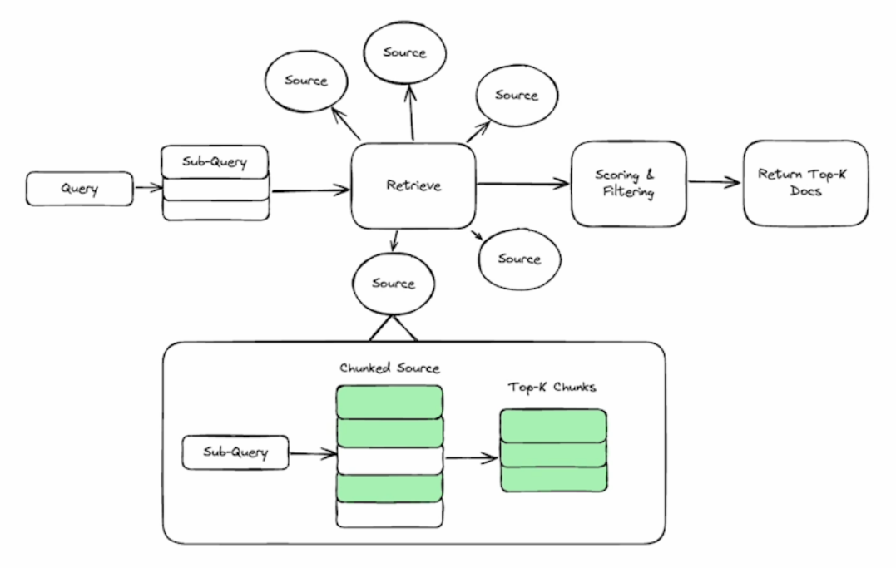

# Lab 3: エージェント型検索ツール

エージェント型検索という、AIエージェントによって使用されるより高度な検索形態の概念を紹介するセクションへようこそ。標準的な検索やゼロショット学習とは異なり、エージェント型検索はエージェントが動的データにアクセスし、情報のソースを提供し、複雑なクエリをサブクエスチョンに分解して処理することを可能にします。このプロセスには、クエリの理解、情報の最適なソースの選択、関連データの抽出、そして重要度の低い詳細のフィルタリングが含まれます。このアプローチは幻覚（ハルシネーション）を減らし、人間とコンピュータの相互作用を改善するのに役立ちます。

このセクションでは、実践的な例を通じて、通常の検索ツールとエージェント型検索ツールの違いを示します。サンフランシスコの天気に関するクエリを使用して、通常の検索（`DuckDuckGo`を使用）が有用な情報を抽出するためにさらなる処理を必要とするリンクを提供することを示しています。対照的に、エージェント型検索ツール（`Tavily`を使用）はJSON形式の構造化データを返し、これはAIエージェントが処理するのに理想的です。

エージェント型検索ツールの実装の基本的な例が以下の画像に示されています。

エージェントがクエリを検索ツールに送信することを決定すると、まず質問を理解し、必要に応じてサブクエスチョンに分割します。これは複雑なクエリを処理するためにエージェントを可能にする重要なポイントです。次に、各サブクエリに対して、検索ツールは複数の統合から選択して最適なソースを見つける必要があります。例えば、エージェントが「サンフランシスコの天気はどうですか？」と尋ねた場合、検索ツールは最良の結果を得るために天気APIを使用するべきです。仕事は正しいソースを見つけることで終わりません。検索ツールはサブクエリに関連する情報のみを抽出する必要があります。

これの基本的な実装は、ソースをチャンク化し、クイックなベクトル検索を実行してトップKチャンクを取得するプロセスを通じて達成できます。ソースからデータを取得した後、検索ツールは結果をスコアリングし、関連性の低い情報をフィルタリングします。この実装は以下の画像に示されています。

さあ、始めましょう！