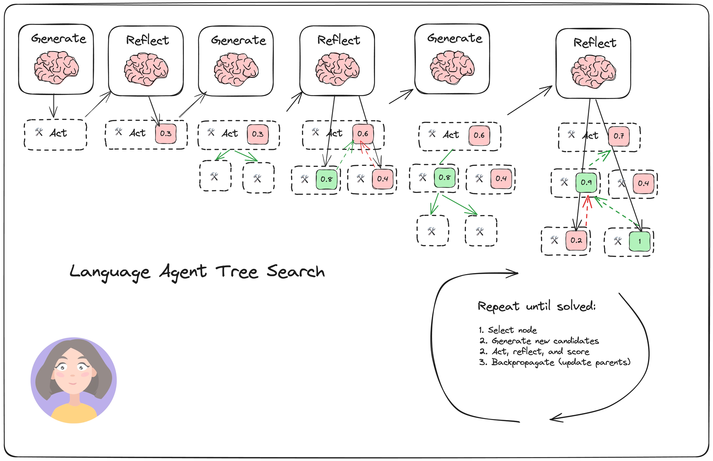

# Lab 6: エッセイライター

このセクションでは、これまでに学んださまざまな概念を組み合わせた興味深いプロジェクトに取り組みます：AIを活用したエッセイライターを構築します。このプロジェクトでは、Amazon BedrockとAnthropic's Claudeモデルを使用して、より複雑なマルチステップAIエージェントを作成する方法を示します。

## 学習内容

1. 複雑なタスクのためのマルチエージェントシステムの構築方法
2. LangGraphを使用した状態マシンの実装
3. Tavily APIを使用した外部リサーチ機能の統合
4. システム内のさまざまなサブタスクにAmazon Bedrock上のClaudeを使用する方法
5. AIエッセイライターとやり取りするためのシンプルなGUIの構築

## プロジェクト概要

エッセイライターはいくつかの段階を経て動作します：

1. 計画：エッセイのアウトラインを生成
2. リサーチ：Tavilyを使用して関連情報を収集
3. 執筆：計画とリサーチに基づいて草稿を生成
4. 振り返り：現在の草稿を批評
5. 反復：批評に基づいてエッセイを修正

エージェントのフローは以下の図で表されています

このセクションの終わりには、さまざまなトピックについてエッセイを生成、批評、改良できる機能的なAIエッセイライターが完成します。このプロジェクトでは、最先端の言語モデルとツールを使用した実用的なマルチステップAIアプリケーションの構築について実践的な経験を得ることができます。

さあ、AIエッセイライターの構築を始めましょう！

# 結論

このワークショップの終わりには、独自のエージェントを構築する方法について良い理解が得られているはずです。締めくくる前に、知っておくべき他のエージェントアーキテクチャについていくつか説明します。

- [マルチエージェントコラボレーション](https://github.com/langchain-ai/langgraph/blob/main/docs/docs/tutorials/multi_agent/multi-agent-collaboration.ipynb)：
マルチエージェントアーキテクチャでは、複数のエージェントが共有状態で協力して作業します。これらのエージェントは、プロンプト、言語モデル、ツールの組み合わせであり、それぞれが能力を提供します。重要な点は、すべてのエージェントが同じ共有状態で操作し、それを受け渡すことで、互いの作業を反復的に構築できることです。

- [スーパーバイザーエージェント](https://github.com/langchain-ai/langgraph/blob/main/docs/docs/tutorials/multi_agent/agent_supervisor.ipynb)：
スーパーバイザーエージェントアーキテクチャには、さまざまなサブエージェントの入出力を調整および管理する中央スーパーバイザーエージェントが含まれます。スーパーバイザーは、独自の内部状態とプロセスを持つことができる各サブエージェントの特定の入力とタスクを決定します。マルチエージェントアプローチとは異なり、単一の共有状態はありませんが、スーパーバイザーがサブエージェント間の情報の流れを調整します。

- [フローエンジニアリング](https://arxiv.org/abs/2401.08500)：
AlphaCode論文で説明されているフローエンジニアリングとは、重要なポイントで反復ループによって区切られた、情報の方向性のあるフローを持つアーキテクチャを設計することを指します。このアプローチは、コーディングのような特定の問題領域に合わせた、線形パイプラインと周期的な反復を組み合わせたものです。目標は、手元のタスクに最適な情報の流れと意思決定を設計することです。

- [計画と実行](https://github.com/langchain-ai/langgraph/blob/main/docs/docs/tutorials/plan-and-execute/plan-and-execute.ipynb)：
計画と実行のパラダイムには、明示的な計画フェーズとそれに続く実行フェーズが含まれます。まず、計画または一連のステップが生成され、サブエージェントがそれらを順番に実行します。各ステップの後、結果に基づいて計画が更新または修正される場合があり、計画が完了するか再計画が必要になるまでプロセスが続きます。

- [言語エージェントツリー検索](https://github.com/langchain-ai/langgraph/blob/main/docs/docs/tutorials/lats/lats.ipynb)：
このアプローチでは、可能なアクション状態に対してツリー検索を実行し、アクションを生成し、それらについて考察し、親ノードを更新するために情報をバックプロパゲーションします。これにより、ツリー内の以前の状態に戻ることができ、エージェントは以前の考察や更新からの情報を活用しながら、異なるアクションパスを探索することができます。

